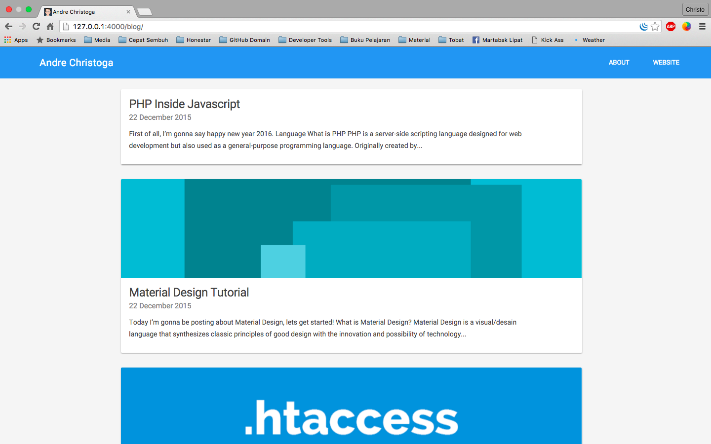

Jekyll Material Design
======================
http://christoga.github.io/blog


Jekyll Material Design is a colorful, beautiful theme for Jekyll user that wants material design in their jekyll blog. 

It's pretty minimal, but leverages large type and drastic contrast to make a statement, on all devices.

The Jekyll theme was crafted with <3 by [Andre Christoga](http://christoga.github.io) (@andrechristoga).

## Getting Started

If you're completely new to Jekyll, I recommend checking out the documentation at http://jekyllrb.com or there's a tutorial by Smashing Magazine.

### Installing Jekyll

If you don't have Jekyll already installed, you will need to go ahead and do that.
```
$ gem install jekyll
```

###  Verify your Jekyll version

It's important to also check your version of Jekyll.

```
$ jekyll -v
jekyll 3.0.1
```

# Installing
Install via Git

```
$ git clone https://github.com/christoga/blog.git
$ cd blog
```

### Fork, then clone

Fork the repo, and then clone it so you've got the code locally.

## Modify the `_config.yml`

The _config.yml located in the root of the Pixyll directory contains all of the configuration details for the Jekyll site. The defaults are:
```
# Site settings
title: Andre Christoga
email: andre.christoga@gmail.com
description: "Tech geek, Technologist, Frontend Dev, Developer, Nerdy Boy, Technokid!"
username: andrechristoga
baseurl: "/blog"
url: "http://christoga.github.io/blog"
paginate: 10
paginate_path: "/halaman/:num/"

# Build settings`
markdown: kramdown
permalink: pretty
gems: [jekyll-paginate]
highlighter: pygments

```
### Jekyll Serve

Then, start the Jekyll Server. I always like to give the --watch option so it updates the generated HTML when I make changes.

$ jekyll serve --watch
Now you can navigate to localhost:4000 in your browser to see the site.

Using Github Pages

You can host your Jekyll site for free with Github Pages. Click here for more information.

A configuration tweak if you're using a gh-pages sub-folder

In addition to your github-username.github.io repo that maps to the root url, you can serve up sites by using a gh-pages branch for other repos so they're available at github-username.github.io/repo-name.

This will require you to modify the _config.yml like so:

# Site settings
title: Repo Name
email: your_email@example.com
author: John Otander
description: "Repo description"
baseurl: "/repo-name"
url: "http://github-username.github.io"

# Build settings
markdown: kramdown
permalink: pretty
paginate: 3
This will ensure that the the correct relative path is constructed for your assets and posts. Also, in order to run the project locally, you will need to specify the blank string for the baseurl: $ jekyll serve --baseurl ''.

If you don't want the header to link back to the root url

You will also need to tweak the header include /{{ site.baseurl }}:

<header class="site-header px2 px-responsive">
  <div class="mt2 wrap">
    <div class="measure">
      <a href="{{ site.url }}/{{ site.baseurl }}">{{ site.title }}</a>
      <nav class="site-nav right">
        
      </nav>
    </div>
  </div>
</header>
A relevant Jekyll Github Issue: https://github.com/jekyll/jekyll/issues/332

## Contributing

* Fork it
* Create your feature branch (git checkout -b my-new-feature)
* Commit your changes (git commit -am 'Add some feature')
* Push to the branch (git push origin my-new-feature)
* Create new Pull Request

