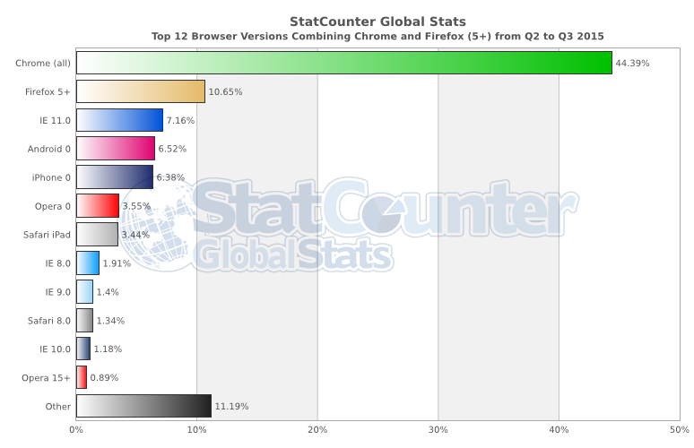
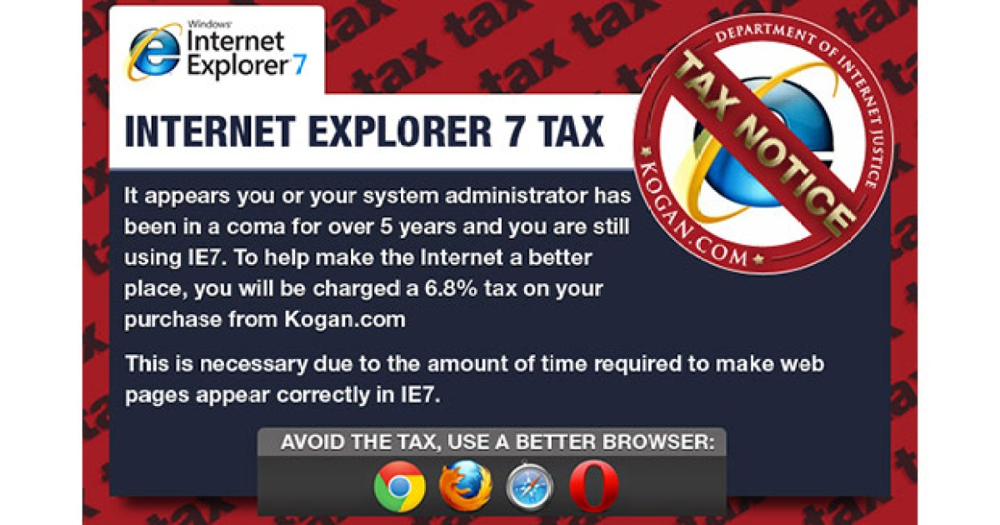

Ah, good ol’ IE8. I’m taking a break from the [_Learning ES6_ series](/learning-es6-series/) to talk about how we should stop supporting the browser that everyone loves to hate: Internet Explorer 8. The bane of our collective existence as web developers. Whether you’re a developer, designer or manager, you know you desperately want to stop supporting it. In this blog post I want to build a case against supporting IE8, examining empirical facts as well as qualitative feelings. My hope is that afterwards you will be well-equipped to make a compelling argument for dropping IE8 like it’s hot.

Despite the playful title of this blog post, this topic is serious business. I feel that we as developers are wasting our time supporting IE8. But there are very legitimate reasons why it’s still supported and why it’s difficult to stop supporting it. So instead of just having a soapbox bash-fest complaining about IE8, let’s instead treat this situation like a court case. We’ll present a case so compelling against IE8 that the judge (aka the boss) will have no choice but to rule in our favor. Cue that _Law & Order_ music!

## TL;DR

Microsoft’s Internet Explorer 8 was released way back in 2009 and yet many developers are saddled with the burden of supporting a browser so feature _incomplete_ that it doesn’t support ES5 let alone HTML5, CSS3 or ES6. The main reason IE8 has lasted so long is because it’s the latest version of IE that will run on Microsoft Windows XP, arguably the most popular Windows operating system.

Because web surfers are unable to upgrade their OS, either because it’s personally too costly or their organization prevents them from doing so, many are stuck using IE8 and are unable to upgrade to a newer version of Internet Explorer. However, the latest versions of other browsers like Chrome or Firefox are still available on XP so it is possible for these users to use a modern browser. IE8 traffic is continuing to decline as well. Worldwide traffic across all devices is [less than 2%](http://gs.statcounter.com/#all-browser_version_partially_combined-ww-quarterly-201502-201503-bar). It would be even lower if the billion users in China were removed.

As any web developer still dealing with IE8 knows, building for, testing with, and debugging on Internet Explorer is pretty difficult. Time spent worrying about IE8 could be better spent building out cool new functionality on the modern browsers that can support it. That’s why sites like [Google](http://googleappsupdates.blogspot.com/2012/09/supporting-modern-browsers-internet.html), [The New York Times](http://www.nytimes.com/content/help/site/ie8-support.html), [SalesForce](https://help.salesforce.com/HTViewSolution?id=000187123), and even [Microsoft](https://support.microsoft.com/en-us/gp/microsoft-internet-explorer) itself are all no longer supporting IE8, choosing to focus on building powerful new web experiences.

These reasons along with additional mounds of evidence should be enough to convince "the powers that be" that IE8 support should be dropped. And while we’re at it, we might as well drop support for IE9 and IE10 as well! They receive even _less_ traffic than IE8.

Intrigued? Want the nitty gritty details? Keep on reading...

## Opening Arguments

Any website created within the last couple of years probably didn’t bother worrying about IE8. They should count themselves lucky. Unfortunately for an older site, IE8 was the big kid on the block, so it had to be supported. And now dropping IE8 support has a tangible cost because it most likely will mean some amount of lost revenue over time.

By the time I left Zazzle, we were still "officially" supporting Internet Explorer 8 although it progressively received less and less love. There were continuous discussions about officially not supporting IE8, but it never got traction because IE8 still accounted for a (small) percentage of revenue.

When I arrived at Eventbrite in May, they had only just recently deprecated Internet Explorer 7! So a lot of my motivation for this blog post is to convince my team that we should go ahead and deprecate IE8 as well. There are just too many reasons why it should be dropped. And hopefully by also sharing these reasons publicly, we can quickly enter a world where IE8 is just a figment of our collective imaginations across the developer community.

At Eventbrite we have a much more formalized process around browser support and deprecation that I really like. Essentially we having a grading system for all browsers:

- **"A grade"** - These browsers are supported sitewide. All flows should function according to design and there should be minimal to zero deviations in visual parity to the design. Progressive enhancement for CSS3 features is allowed. These browsers are actively tested.
- **"B grade"** - All flows should function properly across the site and all content should be accessible. However, only “key” flows need to have visual design parity. These browsers are only occasionally tested.
- **"C grade"** - Content on “key” flows should be accessible and the page shouldn’t look overtly broken. Design bugs in other parts of the site most likely will not be fixed. Only the “key” flows are tested.
- **"Unsupported"** - If the page works, great! But don’t be surprised if there are many bugs. They won’t get fixed. They probably won’t be found because there’s no testing anyway.

Then there is a formal proposal process to downgrade a browser. Right now IE8 is a "B grade" browser with talks to downgrade to "C grade." I would like to kick it all the way to "Unsupported" never to be seen again!

Unfortunately, you can’t just say "hey, let’s stop supporting IE8!" and it happen immediately. If your site has been supporting IE8 for years there will be real revenue lost by no longer supporting it. So in order to convince folks, you need to come armed with data and facts to present a compelling argument, especially for ecommerce sites where the revenue loss can be calculated directly.

## Arguments for IE8

Before we bury Internet Explorer 8 under a mountain of evidence, let’s give it a chance to mount its own defense.  It can explain why we’re at a place where we’re still supporting a browser in 2015 that was built in 2009 and why it’s not so easy to get rid of it.

### Exhibit 1: Windows XP needs IE8

Essentially what it boils down to is that Windows XP users cannot upgrade their Internet Explorer browser past IE8. Internet Explorer 9 won’t work on Windows XP. Furthermore, newer versions of Windows have either been terrible (like Windows Vista & Windows 8) or have much higher system requirements (like the new Windows 10). This means that XP users have trouble upgrading to an operating system that supports a higher version of Internet Explorer. Their only option is to get a newer computer, which is costly whether they are an individual or part of a company.

And speaking of companies, most IT departments at big organizations prevent employees from installing applications  or new browsers. It’s a "security risk." So even if a work employee wanted to switch to the browser they use at home, they wouldn’t be able to. Therefore they have to wait until their IT department first switches **all** computers onto a newer version of Windows. This is how we’re in a world where we have millions of people on a browser from 2009 running on an OS from 2001.

### Exhibit 2: People are still using IE8

About 2% of Internet traffic worldwide comes from Internet Explorer 8. While that may not seem like much, what company wants to throw away 2% of revenues? In a world where an experiment (A/B test) is a success if it results in a conversion lift of just 2% and a failure if there’s any drop off in conversions, potentially losing 2% of traffic is a tough pill to swallow. Furthermore small percentage points of revenue can still be millions and millions of dollars being left on the table.

## Arguments against IE8

The reasons for supporting Internet Explorer 8 are pretty significant, especially when you factor in the likely loss in revenue. But let’s take a look at the (many) reasons why we should no longer be supporting IE8. Once you’ve heard them all, you too will be convinced that they overcome the reasons in support of IE8.

### Exhibit 1: IE8 is over 6 years old(!!!)

Internet Explorer officially debuted on March 19, 2009 and was actually [widely praised](http://www.computerworld.com/article/2481194/internet/internet-explorer-8-is-better-than-firefox-3.html). It initially started off feature-rich, but because it was never updated to add new features being added to other browsers, it quickly became outdated. Browsers age in dog years. Microsoft deserves the blame for choosing to only have major releases spread apart over years instead of continuous micro updates like the evergreen browsers of today.

In fact, IE8 doesn’t even have an auto-upgrade feature. IE8 users have to manually update their browser to IE9. It feels as if the developer community is always dragging along IE browsers because they have sizable market share, yet update so slowly. Thankfully this should be alleviated with the new [Microsoft Edge](https://www.microsoft.com/en-us/windows/microsoft-edge) browser.

Just for kicks, let’s look at what other browser were around back in early 2009 when IE8 was released:

- **Chrome** - Version 2 (now 44)
- **Firefox** - Version 3 (now 39)
- **Safari** - Version 4 (now 8)
- **Opera** - Version 9 (now 31)

### Exhibit 2: Other (newer) browsers are available for WinXP

Now the defense mentioned that work employees are unable to upgrade their IE8 browser because of restrictions. That’s true, but not for everyone. Some people are just lazy. Others are ignorant to the fact that "Internet Explorer" and the "Internet" are not the same thing. The latest versions of [Chrome](https://support.google.com/chrome/answer/95346?hl=en), [Firefox](https://www.mozilla.org/en-US/firefox/39.0/system-requirements/) and [Opera](http://www.opera.com/download/requirements/) all run on Windows XP. They could switch! By the way, [Apple stopped supporting Safari on Windows](http://appleinsider.com/articles/12/07/25/apple_kills_windows_pc_support_in_safari_60) in 2009 so that’s why that’s not a viable option.

So for those users who are able to switch, but are just unaware that they can do so, sites can add a banner alerting those users to the fact that their browser is out of date and that they need to upgrade or switch to a different modern browser. The banner can even link to [Browse Happy](http://www.browsehappy.com/) to list out their browser options.

### Exhibit 3: IE8 has minimal traffic

The defense mentioned that IE8 makes up about 2% of traffic. Well, that’s a really tiny percentage! And in fact that actual number is [1.91% of worldwide traffic](http://gs.statcounter.com/#all-browser_version_partially_combined-ww-quarterly-201502-201503-bar) across all devices and is steadily dropping monthly according to StatCounter. It is the 8th most trafficked browser when you group the various Chrome and Firefox evergreen versions together. Other notable stats:

- IE8 accounts for [2.55%](http://gs.statcounter.com/#all-browser_version_partially_combined-na-quarterly-201502-201503-bar) of North American traffic and [2.72%](http://gs.statcounter.com/#all-browser_version_partially_combined-US-quarterly-201502-201503-bar) in the U.S.
- Europe’s IE8 traffic is [1.31%](http://gs.statcounter.com/#all-browser_version_partially_combined-eu-quarterly-201502-201503-bar) and Asia’s is [1.84%](http://gs.statcounter.com/#all-browser_version_partially_combined-as-quarterly-201502-201503-bar).
- China may very well be the largest user base of IE8 at [5.45%](http://gs.statcounter.com/#all-browser_version_partially_combined-CN-quarterly-201502-201503-bar)
- When just looking at desktop traffic, IE8 comprises [3.18%](http://gs.statcounter.com/#desktop-browser_version_partially_combined-ww-quarterly-201502-201503-bar). It’s 4th after Chrome, Firefox & IE11
- Not surprisingly Windows XP still makes up [6.21%](http://gs.statcounter.com/#all-os-ww-quarterly-201502-201503-bar) of traffic

StatCounter provides a code snippet that web developers can put on their websites to track their traffic. It’s been around since before Google Analytics. Because they’re used on such a vast array of websites, they may be the best authority on global traffic numbers. Besides Google of course. But we’ll talk about Google in more detail in a little bit.

Of course what’s most important is a particular site’s own traffic distribution across browsers. It doesn’t matter if global IE8 traffic is less than 2% if a specific site’s traffic is 50% IE8. However, it’s more likely that a given site’s numbers are less than the worldwide numbers. As sites pay less and less attention to IE8 (even if it is "officially" supported), the site’s functionality progressively degrades in IE8, which in turn decreases its IE8 traffic. This is the case currently with Eventbrite. Our numbers are actually significantly less than the global numbers.

### Exhibit 4: Traffic % and revenue % are not the same

Most sites track the success of their site by its conversion rate. A simplified explanation is that it is the number of people who successfully complete some important task divided by the total number of visitors to the site. That important task could be a purchase, click on an ad, share/like/post, etc.

Sites also have the concept of average order size (AOS). This is mostly used for ecommerce sites, but could still apply broadly. Essentially it answers the question: when a person purchases, clicks or shares, how much of it do they do? A person who spends $100 on a site is more valuable than someone who only spends $10 with each order.

It’s well-known that browsers on Apple devices tend to [generate more revenue on ecommerce sites](http://www.wsj.com/articles/SB10001424052702304458604577488822667325882). This isn’t because Apple devices are better, but because of the demographic of users who own Apple devices. They, on average, have more money to spend. That’s how they have Apple devices in the first place! Now think about the demographic of users still stuck on IE8 and XP. Would you classify them as big spenders or otherwise highly active? Probably not.

Of course each individual site will have to look at their own data to see how things shake out. But contrary to what the defense would lead you to believe, a 2% loss of traffic from dropping IE8 probably will not mean a 2% loss in revenue. It will likely be much lower.

### Exhibit 5: Other big companies have dropped IE8

In 2011, Google announced that their Google Apps services would "only support the latest version of Google Chrome as well as the current and prior major release of Firefox, Safari and Internet Explorer on a rolling basis." Each time a new version of one of those browsers is released, they begin to "support the newly released version and stop supporting the third oldest version." So in keeping with their plan, [Google officially dropped support for Internet Explorer 8](http://googleappsupdates.blogspot.com/2012/09/supporting-modern-browsers-internet.html) on November 15, 2012 on the heels of the IE10 release. After that date, users accessing Google Apps service via IE8 got a message recommending that they upgrade their browser (see Exhibit 2).

Why did Google adopt this policy? Here’s their official statement:

> At Google, we’re committed to developing web applications that go beyond the limits of traditional software. Our engineering teams make use of new capabilities only available in modern, up-to-date browsers which also provide improved security and performance.

At the end of 2013, Google announced that [Google Analytics would stop supporting IE8](http://analytics.blogspot.com/2013/09/supporting-modern-browsing-experience.html). Google Analytics would of course still measure IE8 traffic, you just would no longer be able to reliably read your reports in IE8.

Other notable companies giving IE8 the boot:

- [**Twitter**](https://twitter.com/Support/statuses/260450898084511744) - suggested on October 22, 2012 that users switch from IE8 after a major IE8-only bug
- [**Jira**](https://confluence.atlassian.com/display/JIRAKB/2013/10/24/End+of+support+announcement+for+IE8) - October 24, 2013
- [**New York Times**](http://www.nytimes.com/content/help/site/ie8-support.html) - June 9, 2014
- [**Sales Force**](https://help.salesforce.com/HTViewSolution?id=000187123) - June 2015

But none of those companies can compare to Microsoft deciding to distance itself from IE8. It's very own browser! On April 18, 2014, [Microsoft ended support for Windows XP](https://www.microsoft.com/en-us/WindowsForBusiness/end-of-xp-support), begging users to upgrade to a modern operating system like Windows 8.1. This also unofficially ended support for IE8 as well; at least for IE8 running on WinXP. But Microsoft will officially [stop supporting Internet Explorer 8](https://support.microsoft.com/en-us/gp/microsoft-internet-explorer) on January 12, 2016. At that point, there’s absolutely no reason for websites to continue to hang on. But we don’t have to wait until 2016! Drop it now!

### Exhibit 6: Windows XP has security issues

Malicious hackers continue to exploit operating systems. Windows XP is one of their favorite playgrounds. And now that Microsoft has ended support for WinXP, any exploits found won’t even be patched! Shouldn’t this be enough motivation for IT departments still stuck on XP to final move to a new OS like Windows 10?

Microsoft on its official ["stop using Windows XP"](https://www.microsoft.com/en-us/WindowsForBusiness/end-of-xp-support) page listed the following potential risks of continuing to run Windows XP SP3 after support stopped on April 8, 2014:

- **Security.** Without critical Windows XP security updates, your PC may become vulnerable to harmful viruses, spyware, and other malicious software which can steal or damage your business data and information. Anti-virus software will also not be able to fully protect you once Windows XP itself is unsupported.
- **Compliance.** Businesses that are governed by regulatory obligations such as HIPAA may find that they are no longer able to satisfy compliance requirements. More information on HHS’s view on the security requirements for information systems that contain electronic protected health information (e-PHI) can be found here ([HHS HIPAA FAQ - Security Rule](http://www.hhs.gov/ocr/privacy/hipaa/faq/securityrule/2014.html)).
- **Lack of Independent Software Vendor (ISV) support.** Many software vendors will no longer support their products running on Windows XP as they are unable to receive Windows XP updates. For example, the new Office takes advantage of the modern Windows and will not run on Windows XP.
- **Hardware manufacturer support.** Most PC hardware manufacturers will stop supporting Windows XP on existing and new hardware. This will also mean that drivers required to run Windows XP on new hardware may not be available.

### Exhibit 7: Windows XP and https don’t mix (well)

At [Google I/O 2014](https://www.google.com/events/io), Google called for ["HTTPS everywhere"](https://www.youtube.com/watch?v=cBhZ6S0PFCY) on the web. Every site should provide extra security by running their entire site on https. Gone are the days when log-in and checkout  were the only portions of the site in https. Google is also starting to use [https as a ranking signal](http://googleonlinesecurity.blogspot.com/2014/08/https-as-ranking-signal_6.html).

[SHA-2](https://en.wikipedia.org/wiki/SHA-2) is now the standard for providing https encryption on the web. However, any SHA-2 encrypted website being viewed by IE8 running on XP SP1 or XP SP2 simply won’t work. It only works on Windows XP, Service Pack 3. And only because Windows added it to SP3 after the fact. Apparently Eventbrite ran into this very problem shortly before I started. As a result, Internet Explorer 8 on SP1 or SP2 was officially moved to "Unsupported."

### Exhibit 8: IE8 has no ECMAScript 5 support

As we learned in the [History of ECMAScript](/learning-es6-history-of-ecmascript/) blog post, ECMAScript 5 was released in December 2009, nine months after Internet Explorer 8. Therefore, IE8 doesn’t have any ES5 support. Quick overview on [ES5 features lacking in IE8](http://caniuse.com/#feat=es5):

- [Strict mode](http://caniuse.com/#feat=use-strict)
- Array methods like `indexOf`, `forEach`, `map` & `filter`
- Object methods like `keys` & `create`
- String methods like `trim`
- `Function.prototype.bind`
- Reserved words as keys for object literals
- Allowance for dangling commas (can be fixed by JS minifiers)
- [JSON `parse` & `stringify`](http://caniuse.com/#feat=json) (technically works but IE8 has to be in [standards mode](https://msdn.microsoft.com/en-us/library/cc288325.aspx)

We also learned in the [Using ES6 right now](/learning-es6-using-es6-right-now/) blog post that the best way to use ES6 is to transpile it down to ES5. But IE8 doesn’t support ES5 So there’s a good chance that our transpiled code won’t be able to run successfully in IE8. Stop holding us back IE8!

### Exhibit 9: IE8 has no HTML5 support

The fifth revision of the HTML standard (aka [HTML5](https://en.wikipedia.org/wiki/HTML5)) was officially completed and released in October 2014. However a lot of its functionality had made its way to browsers long before. IE8 does not support any HTML5. Neither does IE9. IE10 only supports a little bit.

HTML5 introduced a number of new elements, new attributes on existing elements, and new native JavaScript APIs. According to caniuse.com, there are [**42** different HTML5 features](http://caniuse.com/#cats=HTML5) none of which IE8 supports. Here are some of the most popular ones:

- [Semantic elements](http://caniuse.com/#feat=html5semantic) like `header`, `footer`, `section`, `article`, etc.
- [`data-*` attributes](http://caniuse.com/#feat=dataset)
- [Number](http://caniuse.com/#feat=input-number), [color](http://caniuse.com/#feat=input-color), [email, telephone & URL](http://caniuse.com/#feat=input-email-tel-url) input types
- [Advanced form features](http://caniuse.com/#feat=forms) like [date & time pickers](http://caniuse.com/#feat=input-datetime), [sliders](http://caniuse.com/#feat=input-range), [validation](http://caniuse.com/#feat=input-pattern), [placeholders](http://caniuse.com/#feat=input-placeholder), and [multiple file uploads](http://caniuse.com/#feat=input-file-multiple)
- [Audio](http://caniuse.com/#feat=audio) & [video](http://caniuse.com/#feat=audio) elements
- [Canvas](http://caniuse.com/#feat=canvas), [SVG](http://caniuse.com/#feat=svg-html5) & [WebGL](http://caniuse.com/#feat=webgl)
- [Drag & drop](http://caniuse.com/#feat=dragndrop)
- [Navigation Timing ](http://caniuse.com/#feat=nav-timing)
- [Session history management](http://caniuse.com/#feat=history)
- [Geolocation](http://caniuse.com/#feat=geolocation)
- [Web Workers](http://caniuse.com/#feat=webworkers)

A lot of these HTML5 features do come with JavaScript shims via external libraries, but those introduce more problems we’ll get to in Exhibits 14 & 15.

### Exhibit 10: IE8 has no CSS3 support

Coupled with HTML5 was CSS3, which greatly expanded the expressiveness and capabilities of CSS. Many things that developers had to resort to coding in JavaScript could now be done more optimally in CSS. Here’s a tasty list:

- [Transitions](http://caniuse.com/#feat=css-transitions) & [animations](http://caniuse.com/#feat=css-animation)
- [Rounded corners](http://caniuse.com/#feat=border-radius)
- [Media queries](http://caniuse.com/#feat=css-mediaqueries)
- [Flexible box layout](http://caniuse.com/#feat=flexbox)
- [Advanced selectors](http://caniuse.com/#feat=css-sel3) like `:not` & `:last-child`
- [opacity](http://caniuse.com/#feat=css-opacity) (technically supported by IE’s proprietary `filter` property)
- [filters](http://caniuse.com/#feat=css-filter-function) and [gradients](http://caniuse.com/#feat=css-gradients) (some supported by IE’s proprietary `filter` property)
- [2D](http://caniuse.com/#feat=transforms2d) & [3D](http://caniuse.com/#feat=transforms3d) transforms
- [`calc()`](http://caniuse.com/#feat=calc)
- [Viewport units](http://caniuse.com/#feat=viewport-units)
- [Colors](http://caniuse.com/#feat=css3-colors) like `rgba()` and `hsl()`
- [Background-image options](http://caniuse.com/#feat=background-img-opts)
- [Web fonts](http://caniuse.com/#feat=fontface)

### Exhibit 11: IE8 has no ECMAScript 6 support

Naturally if IE8 doesn’t support ES5, it’s definitely not going to support ES6. You can find the full features list in the [Goals & Features of ECMAScript 6](http://caniuse.com/#feat=css-animation) blog post. And remember, since IE8 doesn't support ES5 there's a possibility that your transpiled ES6 code will not work in IE8 either. Way to hold the Web back, IE8...

### Exhibit 12: Graceful degradation doesn’t work

Graceful degradation was a big promise in 2013 and 2014 during the big HTML5 hoopla. Web developers could start using new HTML5 and CSS3 features immediately because the old browsers that didn’t support them will gracefully ignore the functionality that it doesn’t understand. While this was technically true, in practice it really was not.

Graceful degradation worked well for what can be described as "icing" features. These features like input placeholders, rounded corners, and transitions. It didn’t work so well for "cake" features like layout. [Flexbox](https://css-tricks.com/snippets/css/a-guide-to-flexbox/) made layout ridiculously easy with CSS3, but the "graceful degradation" result is a broken layout in IE8. So in order to not have a broken experience in a supported browser, we developers are left with `float` or `inline-block` hacks. Ugh.

### Exhibit 13: Mobile first fails</h3>

Mobile marketshare increases every month as more and more users access their favorite websites on their mobile devices. While StatCounter says about 40% of traffic is non-desktop, many sites are seeing more than half of their traffic come from mobile. This is why [Luke Wroblewski](https://twitter.com/lukew) pushed for [mobile-first design](http://www.lukew.com/ff/entry.asp?933) way back in 2009, publishing his [_Mobile First_](http://abookapart.com/products/mobile-first) book in 2011.

Even if we get mobile-first designs from designers, we still cannot implement mobile-first because of IE8. Ideally we would write our CSS such that the default styling is for narrow (mobile) screens. Then using [media queries](https://developer.mozilla.org/en-US/docs/Web/Guide/CSS/Media_queries), we can write CSS for devices larger than narrow screens such as tablets. We could continue the process targeting large desktop screens and even huge TV screens.

But because IE8 does not support media queries (see <a href="#exhibit-10-ie8-has-no-css3-support">Exhibit 10</a>), we’re left with two sucky options. We write our CSS such that the default styling is for large screens and work our way down. This is effectively mobile-last implementation and usually results in overriding a lot of CSS rules to remove stylings not needed at smaller screen sizes. Our other option is to do a mobile-first implementation and have separate IE8-specific CSS. This results in a large amount of duplicate code between it and the CSS targeting the desktop screen sizes.

### Exhibit 14: IE8 forces code bloat on modern browsers

I’ve already alluded to it in Exhibits 8, 9 & 13, but it’s worth focusing in on the problem of code bloat. Because IE8 doesn’t support so many features available in today’s modern browsers, many people have come up with workarounds:

- Trick IE8 into thinking it has modern functionality via [shims/polyfills](https://github.com/Modernizr/Modernizr/wiki/HTML5-Cross-Browser-Polyfills) (like [eventie](https://github.com/desandro/eventie), [classie](https://github.com/desandro/classie) & [doc-ready](https://github.com/desandro/doc-ready))
- Leverage libraries that provide the missing functionality
- Detect via [Modernizr](http://modernizr.com/) that IE8 doesn’t have functionality so we can use fallback code (like Flash for HTML5 video)

All of these approaches result in additional code that would not be needed if IE8 had native support for the functionality. Modern browsers get all of this just-for-IE8 code as well even though they have native support. Modern browsers are heavier because of IE8.

Think about libraries like [jQuery](https://jquery.com/) and [underscore.js](http://underscorejs.org/) that are used so widely that they’re basically standard. But when you look at underscore.js’s API, a lot of its methods are just wrappers over what’s now become native functionality introduced with ES5 and ES6. But the library still needs to implement the functionality itself in JavaScript to support the browsers like IE8 that don’t have the native support. How much lighter would underscore.js be if it could rely on the native JavaScript support?

And what about jQuery? They [introduced jQuery 2.0](http://blog.jquery.com/2013/04/18/jquery-2-0-released/) back in 2013 and were able to shave off 12% of code simply by no longer supporting IE 6/7/8. This was a step in the right direction; moving the web forward. jQuery’s developers could stop worrying about IE8 and focus on evergreen browsers. However, [jQuery announced jQuery 3.0](http://blog.jquery.com/2014/10/29/jquery-3-0-the-next-generations/) that is supporting two parallel codebases. The preferred jQuery 3.0 targets evergreen browsers and is the successor to jQuery 2. But there is also jQuery Compat 3.0, which succeeds original jQuery and continues to support legacy browsers. So much for the jQuery team not having to waste their time with IE8...

### Exhibit 15: IE8 runs even slower emulating modern browsers

What happens when your site needs to display videos and in order to support IE8 you use a library that falls back "gracefully" from HTML5 video to Flash? What happens when an animation is critical to some site functionality so you have to resort to using jQuery instead of making use of CSS3 transitions? What happens when your site relies on geolocation and in order to support IE8 you need to include a large library that uses IP address location when the geolocation API is unavailable?

What happens when you try to get IE8 to support functionality that it was never intended to support? You throw a lot more code at it and it runs even slower! Think about all the extra CSS hacks needed to try to emulate CSS3 flexbox for IE8. Think about all the jQuery written by developers to simulate media queries, `calc()`, and HTML5 placeholders. Not only are we creating a bloated code base for modern browsers (revisit Exhibit 14), but we’re also slowing down the very browser we’re trying to support. It may be functional, but it’s barely usable.

### Exhibit 16: UI frameworks aren’t supporting IE8

The proliferation of UI frameworks is what has enabled developers to keep building more complex websites. Everyone doesn’t have to reinvent their own wheel every time they build an app. One person (or a group of people) can invent a wheel and share it with thousands of people on [Github](https://github.com/).

The UI framework developers are also getting tired of having to support IE8. We already discussed jQuery, what they did with jQuery 2 and what they wish they could do with jQuery 3. But it’s not just jQuery. Other frameworks are dropping IE8 as well:

- [Foundation](http://zurb.com/article/1265/ie8-is-going-the-way-of-the-dodo-so-why-s)
- [Bootstrap 4](http://blog.getbootstrap.com/2015/08/19/bootstrap-4-alpha/)
- [Ember 2.0](http://emberjs.com/blog/2015/04/20/ie8-support-update.html)
- [AngularJS 1.3](http://angularjs.blogspot.com/2013/12/angularjs-13-new-release-approaches.html)

All of them cite wanting to "move forward" and "not be slowed down" by having to support such a legacy browser.

### Exhibit 17: Testing IE8 is a pain

Ideally if you officially support a browser, you should test features on that browser before shipping it to your users. That’s not so easy with older versions of Internet Explorer, including IE8. How does one get their hands on a 6-year-old browser? A Microsoft-supplied [virtual machine](http://dev.modern.ie/tools/vms/) of course! We at least have to applaud Microsoft for providing a way for developers, particularly those not on Windows, to test IE browsers.

But even if you are able to get a multi-gigabyte VM running or even if you are able to use IE11 and change the document mode down to IE8, you’re still testing on IE8! It’s just another browser to have to test. As a result, it doesn’t get tested in development. And unless it’s a big feature, it probably won’t get tested during QA either. More than likely it’ll be users calling into Customer Support who will first notice the IE8-specific issue.

### Exhibit 18: Debugging visual issues in IE8 is a pain

As a developer, which would you rather be doing? Debugging why a `
` that should have some height is collapsed in IE8, or moving on to the next new feature? Yeah, I thought so. In my opinion, the debugging tools in IE browsers are subpar compared to other browsers. And this is particularly true for IE8 and debugging CSS.

The cost in having to fix bugs in a legacy browser is real. So real that a company called Kogan in Australia implemented the world’s first [Internet Explorer 7 Tax](https://www.kogan.com/au/blog/new-internet-explorer-7-tax/) back in 2012 for IE7 users. At the time, they added a 6.8% surcharge on all purchases "by anyone still insistent on using the antique browser."

### Exhibit 19: IE has a bad rep

All Internet Explorer browsers now have a bad reputation for being terrible browsers. IE11 is actually a pretty good browser. It is as standards compliant as the other modern browsers, but because of IE8 (and its predecessors) it still has the "IE stench." That "stench" is so strong that Microsoft is completely forgoing the Internet Explorer name and rebranding its new browser as [Microsoft Edge](https://www.microsoft.com/en-us/windows/microsoft-edge). Edge will be an evergreen browser so it’ll always be up to date with the latest features.

But we’re still stuck with IE8, much to the disdain of web developers worldwide. So in order to publicly share their disgust, [Break Up with IE8](http://breakupwithie8.com/) was born. There you can share your IE8 break-up letter with the public.

### Exhibit 20: Once IE8 goes, so does IE9 & IE10!

Let’s end on a positive note. If we look back at StatCounter’s [global traffic numbers](http://gs.statcounter.com/#all-browser_version_partially_combined-ww-quarterly-201502-201503-bar), IE8 actually had more traffic than IE9! And IE9 had more than IE10. The vast majority of IE9 and IE10 users can upgrade to IE11 and have already done so. The only real reason to support IE9 & IE10 right now is because we’re still supporting IE8. But after these compelling arguments, IE8 is all but out the door. And it might as well take IE9 and IE10 with it.

This means that if we drop IE8 (and IE9 & IE10 with it), we only need to support IE11 and Edge. We’ll now all be on the Google support policy. And with Microsoft giving away free upgrades to Windows 10, soon most people will be on Microsoft Edge as well. If Microsoft gets its way and everyone quickly gets on Edge, we only need to actively support 5 browsers: Chrome, Firefox, Safari, Opera, and Edge. What a wonderful world that would be!

## Closing Arguments

If you’ve actually read this far, congratulations! You’ve definitely been inundated with more evidence than you thought you ever needed. It’s pretty much an open and shut case, right? Now what’s left is for the judge (aka the boss) to rule in favor of dropping IE8. All I ask is that you celebrate the verdict in style. It’s certainly well-earned.

Now my personal objective is to take this evidence to my team at Eventbrite and try to get IE8 kicked completely off the supported list. Let’s just skip the whole "C browser" stage altogether. We can make IE9 the "C browser" and IE10 the "B browser," even though I’d prefer that they all get kicked off of the list. Wish me luck! I’ll report back with updates.

Feedback? Additions? Differing opinion? Feel free to leave a comment or tweet me [@benmvp](https://twitter.com/benmvp).
