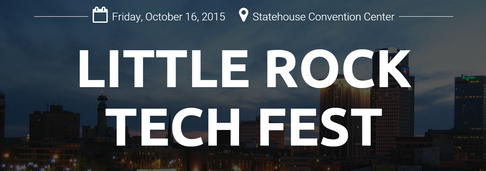

Last month on October 16th I had the opportunity to give my first technical talk in a public setting at the [Little Rock Tech Fest 2015](http://lrtechfest.com/). My talk was entitled _Sugar & Spice and Everything nice about ES6_ and it was based on the [_Learning ES6 series_](/learning-es6-series/).

I think the talk went well. The audience overall wasn't particularly JavaScript savvy so it was a challenge to explain improvements to JavaScript with ES6 when folks were unfamiliar with ES3/ES5. There were a handful of knowledgeable folks that got something out of it, however. But it ended up being a blessing because I got great practice and it was a positive learning experience. I learned two main things from the talk:

First, as much as I want to, I cannot explain the whole world. Even though I had 50 minutes (which feels like a long time) there are 30+ features added to ES6 so there was no way I could even adequately explain half of them. I think I ended up trying to explain half of the features and it was just way too much. Way too much for me and way to much for the audience.

Second, I realized that when I am explaining how a piece of technology works, the _why_ is just as important (if not more important) than the _how_. I can explain _how_ destructuring works to the cows come home, but if I don't properly explain _why_ we as JavaScript developers should use it, most people won't feel any sense of motivation to learn.

I just gave a shorter 30-minute version of the talk at Nodevember 2015 where I did focus on the _why_ as well as narrowing the scope of the talk. As a result, it went a whole lot better (for me and the attendees). If you're looking to learn more about ECMAScript 6, I would suggest watching that video instead. However, if you want to see the Little Rock Tech Fest video, here you go!

<iframe src="//player.vimeo.com/video/142865720" width="567" height="318" style="margin:0 auto;" frameborder="0" webkitallowfullscreen mozallowfullscreen allowfullscreen></iframe>

You can find the PDF slides here: [https://drive.google.com/file/d/0B3vWDhvtt22UNW9qQzlNb09JRDA/view](https://drive.google.com/file/d/0B3vWDhvtt22UNW9qQzlNb09JRDA/view)

Hopefully this will be the first of many, many more to come!
