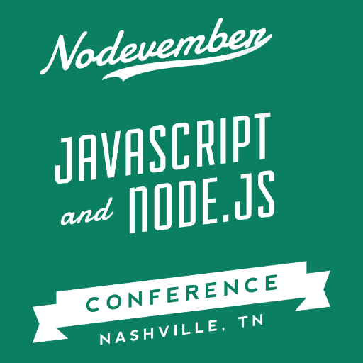

I'm just returning from speaking at [Nodevember 2015](http://nodevember.org/), a community-driven Node and JavaScript conference in Nashville, TN. It was such a blessing to have the opportunity to speak at such an awesome conference along some amazing speakers. My talk was entitled _Sugar & Spice and Everything nice about ES6_ and it was based on the [_Learning ES6 series_](/learning-es6-series/).

Like I mentioned in my recap of [Little Rock Tech Fest 2015](/little-rock-tech-fest-2015/), I drastically changed my slides for Nodevember. My talk could only be 30 minutes so I was pretty much forced to narrow the scope of the talk. I also decided to focus on the _why_ of learning ES6. The position I took was that using the syntactic sugar features introduced with ECMAScript 6 would help us write code that was either clearer or more succinct than its ES3/ES5 equivalent.

The talk went _very_ well. Because I had a whole lot more practice, my delivery was substantially better than at LRTF. I barely even looked at my notes and was able to keep a consistent cadence to the talk. But the feedback I received from the attendees was so overwhelmingly positive. I got a lot of positive feedback on Twitter from folks who came to the talk. But what was really surprising was all the people who came up to me individually in person later on in the day and on Sunday to tell me that they really enjoyed the talk. It had to have been at least 30 separate people. Craziness.

I feel like I delivered the talk according to my plan. I did a pretty good job. Watching the video there was still _lots_ of room for improvement. So I don't feel like the talk I gave was as good as the feedback I received. So the difference really must be the new approach I took with the talk to focus on the _why_. The preparation took a lot of work and it appeared to have paid off. With every feature I showed familiar ES3/ES5 code and then showed how ES6 could make it clearer or more succinct. And for the first few features (block scoping, default parameters and destructuring) we transformed a function with 10 lines of code to one with zero lines, just using ES6. I think that was the hook to reel folks in.

In any event, the success of the talk has convinced me that this is totally something I want to continue to do. I'm not quite sure where God will lead me and what His purpose is behind putting me in this position, but I'm looking forward to the journey and how He'll use me. Maybe I'll end up doing it full time!

Here is the video:

<iframe width="320" height="180" src="https://www.youtube.com/embed/x1BvUqmn8xA?feature=oembed" frameborder="0" allowfullscreen="" style="margin:20px auto;"></iframe>

Here are the new & improved slides (using [reaveal.js](https://github.com/hakimel/reveal.js/)): /slides/nodevember2015-es6.html

And here is the talk abstract:

> ECMAScript 6 is the new version of JavaScript making its way into our modern browsers and interpreters. Some of its features appear to be no more than a little syntax sugar — making development we already do in JavaScript a bit easier. Others add brand new functionality long missing in JavaScript, which allow us to spice up our code without having to include yet another library.
> 
> Experience with JavaScript will help you get the most out of this session, but you don’t have to be a JS ninja to leave confident to begin using ES6 right now. Let’s walk through all the sugar and spice of ES6 and what makes it just so nice. Along the way, you’ll learn about arrow functions, modules, rest parameters, and other features. We’ll also see strategies for how we can circumvent that pesky issue of cross-browser compatibility. Oh, and don’t worry if you didn’t understand any of those terms — you will after the session.

Even though the _Sugar & Spice and Everything nice about ES6_ talk was such a success, I've decided to retire it and replace it with two talks: _Sweet ES6_ and _ECMAScript Spice_. By splitting the talk up into two, it'll hopefully limit the pressure to explain the whole ES6 world in one talk. Plus now I can have an intro level talk (_Sweet ES6_) that just focus on introducing JavaScript developers to ES6 with the syntactic sugar features.

Then those already familiar with ES6 can benefit from the advanced level talk (_ECMAScript Spice_) which will mainly focus on the asynchronous programming features introduced with ES6 (and ES7). I've already applied to a number of conferences with the new talks so we'll see how it goes!

Until then I'll continue the [_Learning ES6 series_](/learning-es6-series/) (I had to take a hiatus to work on slides) and then begin learning React! It's my goal to start speaking about React by Fall of 2016. I'm guessing my first one will be a React + ES6/ES7 talk.  We shall see.
