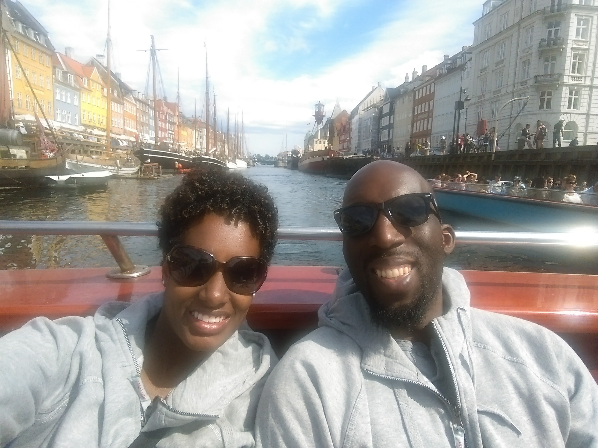

I'm finally a truly international speaker! Last month I flew all the way to Oslo, Norway to speak at [NDC Oslo 2016](http://ndcoslo.com/) on my talk entitled [_You Don't Need JavaScript for That!_](http://ndcoslo.com/talk/you-dont-need-javascript-for-that/) It was all about how we can leverage HTML5 and CSS3 to avoid using JavaScript whenever possible. Technically I've already spoken internationally at [Prairie Dev Con 2016](http://www.prairiedevcon.com/) (Winnipeg, Canada) and [ConFoo Montreal 2016](http://confoo.ca/en/2016/), but Canada doesn't really count. From the Bay Area, it takes longer to get to Florida than it does Canada.

I had a full hour to give the talk, so I was able to not only go through all of my code examples, but also go through several demos. The demo that ended with applause was [Flexbox defense](http://www.flexboxdefense.com/). In the demo we use CSS3 flexbox syntax to defend a tower. This of course hit home with the audience because of [Akershus Fortress](https://en.wikipedia.org/wiki/Akershus_Fortress). Apparently Scandanavian folks are pretty stoic so audiences don't give much feedback to speakers, but I got laughter and applause, so I'd say it went well!

<blockquote class="twitter-tweet" data-lang="en">
Lol <a href="https://twitter.com/benmvp">@benmvp</a> gets mid talk applause after beating a level of Flexbox Defense at <a href="https://twitter.com/hashtag/ndcoslo?src=hash">#ndcoslo</a> <a href="https://twitter.com/NDC_Conferences">@NDC_Conferences</a> <a href="https://t.co/4IoKB9ofWw">pic.twitter.com/4IoKB9ofWw</a>
&mdash; jennz0r (@mybluewristband) <a href="https://twitter.com/mybluewristband/status/741244414689841152">June 10, 2016</a></blockquote>

The conference itself was huge! It was nine tracks over three days! There were 175 talks given by 162 speakers! I can only imagine the logistics of putting that all together. And then there was the venue. It took place at the [Oslo Spektrum](http://www.oslospektrum.no/), which was basically a concert venue. The main floor is where all the sponsor booths and food were held. My coworker, [Jenn Wong](https://twitter.com/mybluewristband) gave the closing keynote there as well.

<blockquote class="twitter-tweet" data-lang="en">
.<a href="https://twitter.com/mybluewristband">@mybluewristband</a> is gonna explain ALL these computer science terms at <a href="https://twitter.com/hashtag/ndcoslo?src=hash">#ndcoslo</a> for us! Haha <a href="https://t.co/DDNqKvCrXp">pic.twitter.com/DDNqKvCrXp</a>
&mdash; Ben Ilegbodu (@benmvp) <a href="https://twitter.com/benmvp/status/740954713831706624">June 9, 2016</a></blockquote>

Then in the stands, they made makeshift stages in the midst of the stadium seating. There wasn't much space on the stage, so I chose to just stay put in front of my laptop for the most part. But arguably the coolest part was that there was overflow room (aka the "ADD room") where they were live-streaming all nine talks at the same time. So if you weren't sure which talk to go to, you could just flip between them and listen with headphones. Pretty impressive.

<blockquote class="twitter-tweet" data-conversation="none" data-lang="en">
Cuuute! <a href="https://twitter.com/evbeng">@evbeng</a> <a href="https://twitter.com/benmvp">@benmvp</a> wife Rashida, daughter Simone, and baby on the way get a shout out! <a href="https://t.co/Q7l32tlz0M">pic.twitter.com/Q7l32tlz0M</a>
&mdash; jennz0r (@mybluewristband) <a href="https://twitter.com/mybluewristband/status/741235003099488256">June 10, 2016</a></blockquote>

My wife Rashida decided to join me on this trip. We left our daughter Simone with the grandparents. This was the first time Rashida had actually heard me speak, which was pretty cool. The only thing she can remember is [Flexbox froggy](http://flexboxfroggy.com/), but that's ok. During and after the conference we toured all around Oslo thanks to those Hop-On-Hop-Off buses. And since it was close by, we also decided to check out Copenhagen, Denmark as well.

All in all, I'd say it was a great experience. I'm definitely impressed by the sheer scale of the conference. If [NDC London](http://ndc-london.com/) and [NDC Sydney](http://ndcsydney.com/) are anything like the Oslo original, you can count me in. I didn't apply for the 2016 edition of NDC Sydney in August on account of baby girl #2, but I may be able to swing NDC London in January 2017. I had actually applied to NDC London 2016, but wasn't accepted. Maybe now that I am an alum with way more speaking experience, I'll have a better shot?

As I mentioned, I had given this talk many times before, and I was actually getting tired of giving it. I felt that it didn't have the same pizzaz as my _Sweet ES6_ talk. Really the only part people seemed to resonate with was the section on CSS3 flexbox. So I decided to retire this talk, take the section on flebox, and expand it to its own talk called _Flexing your Flexbox muscles_. I'm actually already slated to give it at [ConFoo Vancouver 2016](https://confoo.ca/en/yvr2016/session/flexing-your-flexbox-muscles) in early December.

To close, here's the [video](https://vimeo.com/171319733) of the talk:

<iframe src="https://player.vimeo.com/video/171319733" style="margin-bottom:16px" width="640" height="360" frameborder="0" webkitallowfullscreen mozallowfullscreen allowfullscreen></iframe>

And here's the abstract (don't forget the [slides](http://www.benmvp.com/slides/2016/ndcoslo/no-js.html)!):

> We have been using JavaScript toolkits like jQuery for nearly a decade to make manipulating the DOM easier as we create our highly-interactive web apps. New features in HTML5 & CSS3 should’ve made old development strategies obsolete, and yet we’re still using jQuery to do things better suited for HTML5 & CSS3. Why? Well, old habits die hard.

> In this session, let’s look at ways we used to build interactivity in JavaScript and see how we can transform them into more optimal solutions using plain old HTML and CSS. We’ll discuss CSS3 transitions & animations, new HTML5 attributes, and other “tricks” to offload JavaScript functionality to the browser’s rendering engine for more performant web applications. Whether you’re a seasoned JavaScripter or just getting started, you’ll leave the session with fresh ideas to work with.

Many thanks again to the [NDC Oslo](http://ndcoslo.com/) team for inviting me to speak!
