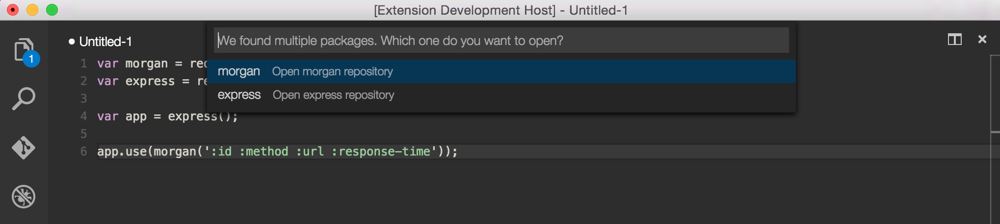

Next week, April 29th will be [Visual Studio Code](https://code.visualstudio.com/)'s 6th birthday! 🎉 I can't remember exactly when I started using VS Code, but I believe it's been around 4 years. It started as a 2-week experiment, and I've never looked back. And I've also converted dozens of coworkers and others over to using it too. 😄

Between full-time work (in JavaScript), side projects (also in JavaScript), and even writing this post (in Markdown), **I use VS Code all the time**. So in honor of its 6th birthday I want to share the 25 VS Code extensions that I frequently use.

---

## Keybindings

Keybindings are critically important in a code editor. Ask any [vim](https://www.vim.org/) user. In fact, keybindings have been the only reason why folks that I know have switched back from VS Code. Being able to quickly perform commands with just the keyboard is essential to feeling productive in an editor.

I used the [Atom](https://atom.io/) code editor from [GitHub](https://github.com/) before switching to VS Code. **So I installed the [Atom Keymap](https://marketplace.visualstudio.com/items?itemName=ms-vscode.atom-keybindings) extension when I initially set up VS Code.** I've been using the extension ever since so at this point I'm not even sure what keyboard shortcuts are from Atom and what are native to VS Code. Every time I install a new instance of VS Code on a new computer, this is my first extension.

## Themes

I open new VS Code windows for every project/repo. Separate windows makes it easy for me to quickly toggle between projects (using the keyboard, of course). I prefer this instead of having one mega instance of VS Code over all of my projects because I dislike having many tabs open, I prefer the mental shift of switching, and I like having an [integrated terminal](https://code.visualstudio.com/docs/editor/integrated-terminal) for each project.

One downside of many VS Code windows is that it's sometimes hard to quickly know which project I've toggled to. That's where [themes](https://code.visualstudio.com/docs/getstarted/themes) come in. I use the "Dark+" theme that ships with VS Code by default. Then for the projects I use often, I'll use special themes for each so that I can quickly tell which repo. Each window looks visually different. I got this idea from my friend [Kyle Welch](https://twitter.com/kylewelch).

<blockquote class="twitter-tweet">
Awesome idea from <a href="https://twitter.com/kylewelch?ref_src=twsrc%5Etfw">@kylewelch</a> to choose different <a href="https://twitter.com/code?ref_src=twsrc%5Etfw">@code</a> themes for my different workspaces. That way I can easily tell what workspace I&#39;m in when I&#39;m switching.  Can&#39;t wait until my brain finally gets used to it...
&mdash; Ben Ilegbodu 🏀👨🏾‍💻 (@benmvp) <a href="https://twitter.com/benmvp/status/1054818470410342400?ref_src=twsrc%5Etfw">October 23, 2018</a></blockquote>

**The (dark) themes I use are:**

- [Cobalt2](https://marketplace.visualstudio.com/items?itemName=wesbos.theme-cobalt2) by [Wes Bos](https://twitter.com/wesbos)
- [Night Owl](https://marketplace.visualstudio.com/items?itemName=sdras.night-owl) by [Sarah Drasner](https://twitter.com/sarah_edo)
- [Dracula Official](https://marketplace.visualstudio.com/items?itemName=dracula-theme.theme-dracula)

## Git

Since I use VS Code to edit my code and all of my code is in [Git](https://git-scm.com/), git-related extensions are a must. **At work, I use [GitLens](https://marketplace.visualstudio.com/items?itemName=eamodio.gitlens).** It's worth it solely for the inline blame markers. But on my personal computer GitLens was causing problems, **so I use [Git History](https://marketplace.visualstudio.com/items?itemName=donjayamanne.githistory)** so I can at least get a visual history of files without having to jump to GitHub.

However, when I do need to jump to Github, **the [Open in GitHub](https://marketplace.visualstudio.com/items?itemName=sysoev.vscode-open-in-github) extension comes in handy**. **I also have the [GitHub Pull Requests and Issues](https://marketplace.visualstudio.com/items?itemName=GitHub.vscode-pull-request-github) extension**, but I don't really use it.

## Code formatting

After VS Code itself, I would say that [Prettier](https://prettier.io/) is next on the list of tools that have transformed the way I write code. I never realized how much time and mental energy I put into formatting my code.
**The [Prettier - Code formatter](https://marketplace.visualstudio.com/items?itemName=esbenp.prettier-vscode) extension handles all of that work when it formats my code when I save it.** I simply type a long line of code, save, and voilà! Also, Prettier fails to format if there are code syntax errors. So when Prettier does not format I know there's an error before the browser even tells me.

**I also used to use the [final-newline](https://marketplace.visualstudio.com/items?itemName=samverschueren.final-newline) extension to ensure all files had that final newline**, but now Prettier takes care of that.

## Code validating

**The [ESLint](https://marketplace.visualstudio.com/items?itemName=dbaeumer.vscode-eslint) extension is probably my most in-your-face one.** It warns me about all of the problems with my code as I type. The formatting errors will be fixed by Prettier on save, but it catches lots of other rules I have set in my [ESLint config](https://eslint.org/docs/user-guide/configuring/).

**The [Jest](https://marketplace.visualstudio.com/items?itemName=Orta.vscode-jest) extension is pretty cool as well.** It provides feedback within VS Code about which tests, and specifically which assertions, are failing. It's like Jest [watch mode](https://jestjs.io/docs/cli#--watch) but right there with the code.

## Code editing

**The [Auto Rename Tag](https://marketplace.visualstudio.com/items?itemName=formulahendry.auto-rename-tag) extension automatically renames paired HTML/XML tags.** Apparently, this is a feature in the main [Visual Studio IDE](https://visualstudio.microsoft.com/vs/). The renaming works well with React JSX too, which is where I normally make use of it. But sometimes the [Fragment short syntax](https://reactjs.org/docs/fragments.html#short-syntax) really confuses it.

**Whenever I find myself within deeply nested parentheses or curly braces (or both), the [Bracket Pair Colorizer 2](https://marketplace.visualstudio.com/items?itemName=CoenraadS.bracket-pair-colorizer-2) extension comes in handy.** I'm partially color blind, so sometimes it a bit difficult to tell the difference between some colors. But for the most part, it lets me know where a closing parenthesis or curly brace needs to go.

## Packages

No JavaScript project is complete without 3rd-party [npm](https://www.npmjs.com/) packages. I use a few extensions to help make working with npm packages a bit easier.

**The most useful extension is [npm intellisense](https://marketplace.visualstudio.com/items?itemName=christian-kohler.npm-intellisense).** It auto-completes npm module names within import statements. I make use of this so much that I forget it's a separate extension.

**The [Import Cost](https://marketplace.visualstudio.com/items?itemName=wix.vscode-import-cost) extension shows the size of packages right next to the import statements**, but I admittedly pay less attention to it. The idea is that maybe I'll think twice about importing a package when I see how big it is. But with [tree shaking](https://webpack.js.org/guides/tree-shaking/) the numbers are no longer truly indicative of the size I'm pulling in.

I constantly find myself code spelunking in `node_modules` trying to debug why my code is not working with some npm package. My process before was: use the integrated terminal, navigate to the package within `node_modules`, and open up the file within VS Code. **Well, the [Search node_modules](https://marketplace.visualstudio.com/items?itemName=jasonnutter.search-node-modules) extension streamlines that process.** It lets me filter down which package within `node_modules` I want, and then the files within the package.

Sometimes I need to read the source code in GitHub versus the transpiled code within `node_modules`. Instead of Googling the package, going to its page on npm, and then clicking the link to its GitHub page, **the [View Node Package](https://marketplace.visualstudio.com/items?itemName=dkundel.vscode-npm-source) extension takes me right to the source code**.

## Writing

There are 3 extensions that I make heavy use of while writing content, whether documentation or blog posts.

**The first is [Code Spell Checker](https://marketplace.visualstudio.com/items?itemName=streetsidesoftware.code-spell-checker).** It's a basic spell checker but understands that variables in camelCase are separate words. This actually catches misspellings in my code, not just my docs. My only wish is that when it does mark something as misspelled that it would give me suggestions. If it's a word I'm not quite sure how to spell, I end up searching Google with my misspelling so it can tell me the correct way. 🤦🏾‍♂️

**The second is the [Grammarly (unofficial)](https://marketplace.visualstudio.com/items?itemName=znck.grammarly) extension.** This extension is major for my blog posts to help get the same grammar checking in VS Code that I receive in Chrome and Google Docs. It again doesn't provide suggested fixes, only marks the errors. But it certainly catches a lot of them.

**Lastly, I use [Code Snapshot](https://marketplace.visualstudio.com/items?itemName=robertz.code-snapshot) to make my life easier when sharing my code on Twitter.** I select any code, and it generates a beautiful image from it. It's also supposed to allow me to save the image, but that functionality has never worked for me. So I grab a screenshot of the image. It looks better than taking a screenshot of my actual code.

<blockquote class="twitter-tweet">
Who&#39;s interested in mutation-free JS &quot;algorithms&quot; for common data transformations that are only a single statement? Hopefully not just me cuz I&#39;ve got 9️⃣ of &#39;em 😂  1️⃣ Deleting an item from an array by using `.filter` to return everything but the target  /thread 🧵👇🏾 <a href="https://t.co/IPZd6DgyFq">pic.twitter.com/IPZd6DgyFq</a>
&mdash; Ben Ilegbodu 🏀👨🏾‍💻 (@benmvp) <a href="https://twitter.com/benmvp/status/1379569782656135169?ref_src=twsrc%5Etfw">April 6, 2021</a></blockquote>

## Miscellaneous file support

I couldn't quite figure out how to properly title this section. But basically there are a number of non-code formats that I use extensions to provide syntax highlight, formatting or validation.

- [Better TOML](https://marketplace.visualstudio.com/items?itemName=bungcip.better-toml) - syntax highlighting and validation for `.toml` files (I had never heard of TOML before using [Netlify](https://www.netlify.com/))
- [DotENV](https://marketplace.visualstudio.com/items?itemName=mikestead.dotenv) - syntax highlight support for `.env` environment files (actually ported from an extension for SublimeText)
- [Rainbow CSV](https://marketplace.visualstudio.com/items?itemName=mechatroner.rainbow-csv) - highlights and provides info about columns for `.csv` files
- [SVG](https://marketplace.visualstudio.com/items?itemName=jock.svg) - I mainly use this to preview SVGs, which is surprisingly not supported in VS Code
- [YAML](https://marketplace.visualstudio.com/items?itemName=redhat.vscode-yaml) - Provides validation and auto-completion for `.yml` files (seems to be the popular format for CI systems)

## Before we go

This last one didn't fit anywhere, but is beyond valuable. **The [Quit Control](https://marketplace.visualstudio.com/items?itemName=artdiniz.quitcontrol-vscode) extension makes sure that I only quit VS Code when I intend to.** `⌘W` (close a tab) is right next to `⌘Q` (quit VS Code) and there are so many times I've hit `Q` instead of `W`. This feature has saved me many times in Chrome/Firefox, so having this in VS Code has also saved frustrations.

---

And that is all 25 of them. 😅 There are a number of extensions that I used to use that ultimately became core features in VS Code. [Copy Relative Path](https://marketplace.visualstudio.com/items?itemName=alexdima.copy-relative-path) and one adding file path breadcrumbs come to mind. The [native breadcrumbs](https://code.visualstudio.com/docs/editor/editingevolved#_breadcrumbs) support is even better than the extension because it displays breadcrumbs for functions and variables within the file as well.

Many of the extensions I listed are pretty common, so if you're using VS Code, you're probably already using them. But hopefully, there are a few that are new that you'll find helpful. But what I'm most interested in are the ones that I didn't list. **What are the VS Code extensions that you've found invaluable?** I'd love to know so that I can be even more productive. Shoot me a holler at [@benmvp](https://twitter.com/benmvp).

Keep learning my friends. 🤓
