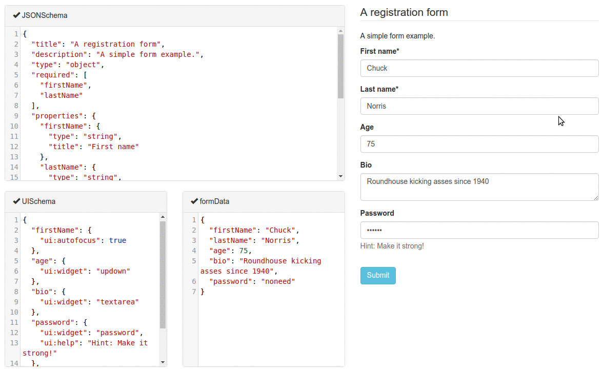

Lately, I've been spending a lot of time figuring out how to validate a UI with an API, specifically that the format of the request/response that the UI expects matches that of the API. [GraphQL](https://graphql.org/) naturally solves this problems (and many other problems as well), but not everyone can immediately switch from [REST](https://restfulapi.net/) to GraphQL.

Enter [JSON Schema](http://json-schema.org/). It is a "vocabulary that allows you to annotate and validate JSON documents." When used with a JSON-based HTTP API, it allows for client and server to validate the request/response agreement.

But I'm actually not here to talk about that aspect of JSON Schema. I wanted to share about a UI library _based_ on JSON schema called [`react-jsconschema-form`](https://react-jsonschema-form.readthedocs.io/). It is a "simple React component capable of building HTML forms out of a JSON schema." It allows you to generate a form for any data, "sight unseen," simply given a JSON schema. It even validates that the submitted data conforms to the given schema, although it won't _prevent_ the user from typing in bad data.

_Try out the [live playground](https://rjsf-team.github.io/react-jsonschema-form/)!_

It uses [Bootstrap](http://getbootstrap.com/) by default for the form elements. So if all you need is a nice looking form, what comes out of the box is great. However, if you have your own component library, it is possible to use [custom field components](https://react-jsonschema-form.readthedocs.io/en/latest/advanced-customization/#custom-field-components) to use your own input fields. There's even [`react-jsonschema-form-material-ui`](https://github.com/vip-git/react-jsonschema-form-material-ui) that uses the awesome [Material UI](http://www.material-ui.com/) component library! The name is a mouthful though.

I'm sure there are lots of other great features I don't yet know about it. But I do know that building and validating forms is always both tricky and annoying. So having something like `react-jsconschema-form` to offload the work is great.

But if you _are_ interested in React form libraries that let you build things from scratch, check out [React Final Form](https://final-form.org/react) or [Formik](https://jaredpalmer.com/formik/).

Keep learning my friends. 🤓
