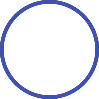
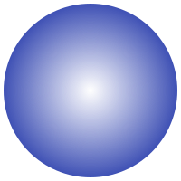
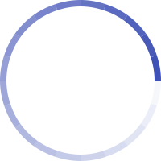
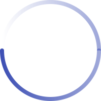

I recently got to work on a different type of project than I normally tackle. Instead of building a React component in TypeScript or configuring a new DivOps setup, I needed to create an SVG gradient loading spinner. It looked like:


The spinner isn't a solid color, but has a gradient from 100% to 0% opacity. The design seemed simple enough, but the implementation ended up being way more complicated than I anticipated. This is because **SVGs don't support adding a gradient to a [`<circle>`](https://developer.mozilla.org/en-US/docs/Web/SVG/Element/circle).** However, it's possible to simulate a gradient with some cleverness.

If you just need an answer so you can move on to solve your problem, here's my final solution. 😄

```html
<svg
  width="200"
  height="200"
  viewBox="0 0 200 200"
  color="#3f51b5"
  fill="none"
  xmlns="http://www.w3.org/2000/svg"
>
  <defs>
    <linearGradient id="spinner-secondHalf">
      <stop offset="0%" stop-opacity="0" stop-color="currentColor" />
      <stop offset="100%" stop-opacity="0.5" stop-color="currentColor" />
    </linearGradient>
    <linearGradient id="spinner-firstHalf">
      <stop offset="0%" stop-opacity="1" stop-color="currentColor" />
      <stop offset="100%" stop-opacity="0.5" stop-color="currentColor" />
    </linearGradient>
  </defs>

  <g stroke-width="8">
    <path stroke="url(#spinner-secondHalf)" d="M 4 100 A 96 96 0 0 1 196 100" />
    <path stroke="url(#spinner-firstHalf)" d="M 196 100 A 96 96 0 0 1 4 100" />

    <!-- 1deg extra path to have the round end cap -->
    <path
      stroke="currentColor"
      stroke-linecap="round"
      d="M 4 100 A 96 96 0 0 1 4 98"
    />
  </g>

  <animateTransform
    from="0 0 0"
    to="360 0 0"
    attributeName="transform"
    type="rotate"
    repeatCount="indefinite"
    dur="1300ms"
  />
</svg>
```

If you're interested in learning about SVGs or how I was able to piece together tidbits from different sources of information to solve the problem, I would love to walk you through my journey. It's my journey in how I learned how to add a gradient along an SVG circular path so that I could create this loading spinner.

---

I started off easy enough by drawing the SVG [`<circle>`](https://developer.mozilla.org/en-US/docs/Web/SVG/Element/circle).

```html
<svg
  xmlns="http://www.w3.org/2000/svg"
  width="200"
  height="200"
  viewBox="0 0 200 200"
  fill="none"
  color="#3f51b5"
>
  <!-- highlight-start -->
  <circle
    cx="100"
    cy="100"
    r="96"
    stroke="currentColor"
    stroke-width="8"
    fill="none"
  />
  <!-- highlight-end -->
</svg>
```



> A couple of things to note. The SVG is 200x200, so we would assume that the radius of the `<circle>` would be `100`. But since the [`stroke-width`](https://developer.mozilla.org/en-US/docs/Web/SVG/Attribute/stroke-width) is `8` and SVGs "draw on both sides of the line", I needed to make the radius 4 pixels shorter (half of 8) so that the circle doesn't get clipped by the bounding box. I also use the value [`currentColor`](https://css-tricks.com/currentcolor/) for the [`stroke`](https://developer.mozilla.org/en-US/docs/Web/SVG/Attribute/stroke) color so that I'd be able to easily control the color of the loading spinner by changing the [`color`](https://developer.mozilla.org/en-US/docs/Web/SVG/Attribute/color) in CSS.

At this point, I figured I was halfway there. But as I already mentioned, SVGs don't support adding a gradient to a `<circle>`. It _does_ support two main types of gradients: [`<linearGradient>`](https://developer.mozilla.org/en-US/docs/Web/SVG/Element/linearGradient) and [`<radialGradient>`](https://developer.mozilla.org/en-US/docs/Web/SVG/Element/radialGradient). However, neither of them worked as I needed with `<circle>`. Let me explain.

The problem with using the linear gradient with the circle is the top and bottom of the circle end up with the same color.

```html
<svg
  xmlns="http://www.w3.org/2000/svg"
  width="200"
  height="200"
  viewBox="0 0 200 200"
  fill="none"
  color="#3f51b5"
>
  <defs>
    <!-- highlight-start -->
    <linearGradient id="spinner-gradient">
      <stop offset="0%" stop-opacity="0" stop-color="currentColor" />
      <stop offset="100%" stop-opacity="1" stop-color="currentColor" />
    </linearGradient>
    <!-- highlight-end -->
  </defs>
  <circle
    cx="100"
    cy="100"
    r="96"
    fill="none"
    stroke="url(#spinner-gradient)"
    stroke-width="8"
  />
</svg>
```



Because the opacity gradient is moving from left to right (using [`<stop>`](https://developer.mozilla.org/en-US/docs/Web/SVG/Element/stop) with [`stop-opacity`](https://developer.mozilla.org/en-US/docs/Web/SVG/Attribute/stop-opacity)), **the two points of the circle at the same X position have the same opacity**. I need the _circumference_ of the circle to go from 100% to 0% opacity.

It just doesn't look quite right when it rotates.


It looks more like a light spot is moving around the circle rather than a circular path with a slowly disappearing tail.

So linear gradient didn't work. But I figured that since we have a circle, the radial gradient would be a better fit. However, that too doesn't work because **the radiating "rings" of the radial gradient are the same color**. As a result, the circle hardly looks any different than the initial circle with no gradient.

```html
<svg
  width="200"
  height="200"
  viewBox="0 0 200 200"
  color="#3f51b5"
  fill="none"
  xmlns="http://www.w3.org/2000/svg"
>
  <defs>
    <!-- highlight-start -->
    <radialGradient id="spinner-gradient">
      <stop offset="92%" stop-opacity="0" stop-color="currentColor" />
      <stop offset="100%" stop-opacity="1" stop-color="currentColor" />
    </radialGradient>
    <!-- highlight-end -->
  </defs>
  <circle
    cx="100"
    cy="100"
    r="96"
    fill="none"
    stroke="url(#spinner-gradient)"
    stroke-width="8"
  />
</svg>
```


All the pixels at radius 92 are at the same 92% opacity. All the pixels at radius 96 are at the same opacity 96% opacity. And all the pixels at radius 100 are at 100% opacity. **The gradient is going along on the _thickness_ of the circle instead of its circumference.** If I temporarily switch the gradient to the [`fill`](https://developer.mozilla.org/en-US/docs/Web/SVG/Attribute/fill), it will visualize the problem a be a bit clearly.



So I was starting to realize that the solution wouldn't be as easy as I had hoped. Part of me just wanted to cut my losses and go with the slightly funky linear gradient solution. But I continued on hoping I'd find something.

I Googled around, but all of the StackOverflow answers said that it wasn't possible. **Apparently what I wanted was a conic (angular) gradient that rotates around a center point**, rather than radiating from the center like the radial gradient. CSS somewhat recently introduced the [`conic-gradient`](<https://developer.mozilla.org/en-US/docs/Web/CSS/gradient/conic-gradient()>) CSS function, but SVG doesn't have its own equivalent yet.

One StackOverflow answer suggested slicing up the circle into smaller "arc segments" and changing the opacity on each path segment. Luckily I found this [SVG circle arc tool](http://xahlee.info/js/svg_circle_arc.html) by [Xah Lee](https://twitter.com/xah_lee) to help generate the arc paths. I tried diving the circle up into 20 segments (each 18°), and used the tool to manually create 20 [`<path>`](https://developer.mozilla.org/en-US/docs/Web/SVG/Element/path) elements with decreasing [`opacity`](https://developer.mozilla.org/en-US/docs/Web/SVG/Attribute/opacity) attribute values.

```html
<svg
  width="200"
  height="200"
  viewBox="0 0 200 200"
  color="#3f51b5"
  fill="none"
  xmlns="http://www.w3.org/2000/svg"
>
  <!-- highlight-start -->
  <g stroke="currentColor" stroke-width="8">
    <path opacity="1" d="M 191 70 A 96 96 0 0 1 196 100" />
    <path opacity="0.95" d="M 178 44 A 96 96 0 0 1 191 70" />
    <path opacity="0.90" d="M 156 22 A 96 96 0 0 1 178 44" />
    <path opacity="0.85" d="M 130 9 A 96 96 0 0 1 156 22" />
    <path opacity="0.80" d="M 100 4 A 96 96 0 0 1 130 9" />
    <path opacity="0.75" d="M 70 9 A 96 96 0 0 1 100 4" />
    <path opacity="0.70" d="M 44 22 A 96 96 0 0 1 70 9" />
    <path opacity="0.65" d="M 22 44 A 96 96 0 0 1 44 22" />
    <path opacity="0.60" d="M 9 70 A 96 96 0 0 1 22 44" />
    <path opacity="0.55" d="M 4 100 A 96 96 0 0 1 9 70" />
    <path opacity="0.50" d="M 9 130 A 96 96 0 0 1 4 100" />
    <path opacity="0.45" d="M 22 156 A 96 96 0 0 1 9 130" />
    <path opacity="0.40" d="M 44 178 A 96 96 0 0 1 22 156" />
    <path opacity="0.35" d="M 70 191 A 96 96 0 0 1 44 178" />
    <path opacity="0.30" d="M 100 196 A 96 96 0 0 1 70 191" />
    <path opacity="0.25" d="M 130 191 A 96 96 0 0 1 100 196" />
    <path opacity="0.20" d="M 156 178 A 96 96 0 0 1 130 191" />
    <path opacity="0.15" d="M 178 156 A 96 96 0 0 1 156 178" />
    <path opacity="0.10" d="M 191 130 A 96 96 0 0 1 178 156" />
    <path opacity="0.05" d="M 196 100 A 96 96 0 0 1 191 130" />
  </g>
  <!-- highlight-end -->
</svg>
```



I got my gradient look, but to me the seams where the opacity changes were too obvious. Even when the circle was spinning I could still see them.


Plus, the gradient just wasn't as smooth because there were only 20 slices. Now I could've added more segments (36? 72? 90? 180?), but then that would be **a lot** of SVG markup for something so little. It also seems like it'd be kind of a nightmare to maintain.

So I again, I wondered if I should cut my losses. Sure the seams were visible, but was it really that bad? But I kept looking around and stumbled upon this [CodePen](https://codepen.io/ionic/pen/GgwVON) that had a bunch of animated spinners, one of which was kind of like what I wanted. Instead of the whole circle being a gradient, though, only the tail was.


When I inspected the markup, I noticed that the developer _did_ use a linear gradient, but just on the tail portion of the arc. So that gave me an idea. What if I applied the same approach? Instead of having one circle with a linear gradient, **I could create two semicircles and apply separate linear gradients to each!** The result was exactly what I wanted! 🙌🏾

```html
<svg
  xmlns="http://www.w3.org/2000/svg"
  width="200"
  height="200"
  viewBox="0 0 200 200"
  fill="none"
  color="#3f51b5"
>
  <defs>
    <!-- highlight-start -->
    <linearGradient id="spinner-secondHalf">
      <stop offset="0%" stop-opacity="0" stop-color="currentColor" />
      <stop offset="100%" stop-opacity="0.5" stop-color="currentColor" />
    </linearGradient>
    <linearGradient id="spinner-firstHalf">
      <stop offset="0%" stop-opacity="1" stop-color="currentColor" />
      <stop offset="100%" stop-opacity="0.5" stop-color="currentColor" />
    </linearGradient>
    <!-- highlight-end -->
  </defs>

  <g stroke-width="8">
    <!-- highlight-start -->
    <path stroke="url(#spinner-secondHalf)" d="M 4 100 A 96 96 0 0 1 196 100" />
    <path stroke="url(#spinner-firstHalf)" d="M 196 100 A 96 96 0 0 1 4 100" />
    <!-- highlight-end -->
  </g>
</svg>
```



I revisted the [SVG circle arc tool](http://xahlee.info/js/svg_circle_arc.html) to create the two semicircles. And because there are 2 linear gradients, I no longer had the problem of 2 points of the circle having the same opacity. The top semicircle has a linear gradient from 0% to 50% and the bottom semicircle has a linear gradient from 100% to 50%. **Because the gradients line up on the right edge at 50% the circle _looks_ like it has a single 100% to 0% gradient!**

And it looked good rotating as well.


I can't describe how excited I was. I wanted to quit multiple times, but because I persevered and found others' prior art, I was able to solve the problem I wasn't sure even had an answer. But I still had one last issue to resolve. 😅

You may notice that the current implementation so far has a flat, hard end to the line. The design called for a soft, round end to the path. **The SVG [`stroke-linecap`](https://developer.mozilla.org/en-US/docs/Web/SVG/Attribute/stroke-linecap) attribute has a `round` option, but it applies to both ends of the path.**

```html
<svg
  xmlns="http://www.w3.org/2000/svg"
  width="200"
  height="200"
  viewBox="0 0 200 200"
  fill="none"
  color="#3f51b5"
>
  <defs>
    <linearGradient id="spinner-secondHalf">
      <stop offset="0%" stop-opacity="0" stop-color="currentColor" />
      <stop offset="100%" stop-opacity="0.5" stop-color="currentColor" />
    </linearGradient>
    <linearGradient id="spinner-firstHalf">
      <stop offset="0%" stop-opacity="1" stop-color="currentColor" />
      <stop offset="100%" stop-opacity="0.5" stop-color="currentColor" />
    </linearGradient>
  </defs>

  <g stroke-width="8">
    <path stroke="url(#spinner-secondHalf)" d="M 4 100 A 96 96 0 0 1 196 100" />
    <path
      stroke="url(#spinner-firstHalf)"
      <!-- highlight-next-line -->
      stroke-linecap="round"
      d="M 196 100 A 96 96 0 0 1 4 100"
    />
  </g>
</svg>
```



So the head of the path is now rounded, but do you also see that tiny dark spot on the right? It's the other end of the bottom semicircle with the round edge. And because of opacity compositing, it's now visible.

So once again, I wondered if it was quitting time. The loading spinner was definitely "good enough" with the hard edge. But I returned to Google this time searching for how to add the `stroke-linecap` to only one end of an SVG path. Unfortunately, like having a gradient along a path, it's not supported directly by SVG. But as it turns out, it is possible to simulate the look.

One StackOverflow answer had a suggestion of putting two lines on top of each other. **There's the main path and then a shorter one on top with the rounded edges.** The lengths and color of the paths can give the illusion of a path with only one end that is rounded.

So I ran with that idea and added a third solid color path to sit on top of the start of the spinner. But I made the path only 1° of arc so that it was short enough that the other rounded end wouldn't be visible along the gradient path. And since the round `stroke-linecap` always protrudes out from the edge of a `<path>`, **placing it right on top of the edge of the main arc gave the illusion that the main path had a rounded edge only on one side.**


Add an SVG [`<animateTransform`>](https://developer.mozilla.org/en-US/docs/Web/SVG/Element/animateTransform), and voilà!


```html
<svg
  xmlns="http://www.w3.org/2000/svg"
  width="200"
  height="200"
  viewBox="0 0 200 200"
  fill="none"
  color="#3f51b5"
>
  <defs>
    <linearGradient id="spinner-secondHalf">
      <stop offset="0%" stop-opacity="0" stop-color="currentColor" />
      <stop offset="100%" stop-opacity="0.5" stop-color="currentColor" />
    </linearGradient>
    <linearGradient id="spinner-firstHalf">
      <stop offset="0%" stop-opacity="1" stop-color="currentColor" />
      <stop offset="100%" stop-opacity="0.5" stop-color="currentColor" />
    </linearGradient>
  </defs>

  <g stroke-width="8">
    <path stroke="url(#spinner-secondHalf)" d="M 4 100 A 96 96 0 0 1 196 100" />
    <path stroke="url(#spinner-firstHalf)" d="M 196 100 A 96 96 0 0 1 4 100" />

    <!-- highlight-start -->
    <!-- 1deg extra path to have the round end cap -->
    <path
      stroke="currentColor"
      stroke-linecap="round"
      d="M 4 100 A 96 96 0 0 1 4 98"
    />
    <!-- highlight-end -->
  </g>

  <!-- highlight-start -->
  <animateTransform
    from="0 0 0"
    to="360 0 0"
    attributeName="transform"
    type="rotate"
    repeatCount="indefinite"
    dur="1300ms"
  />
  <!-- highlight-end -->
</svg>
```

A loading spinner with a gradient "fill" (but actually implemented as a stroke)!

---

And that ends my journey of figuring out how to add a gradient along an SVG circular path in order to create a snazzy loading spinner. I learned so many new things about SVGs along the way. More than I even mentioned in this post. And now I feel way more confident to build SVG animations in the future.

I would love to hear what you thought of this post. Did you learn anything new? Have you had to do something like this before? Feel free to let me know on Twitter at [@benmvp](https://twitter.com/benmvp).

Keep learning my friends. 🤓
