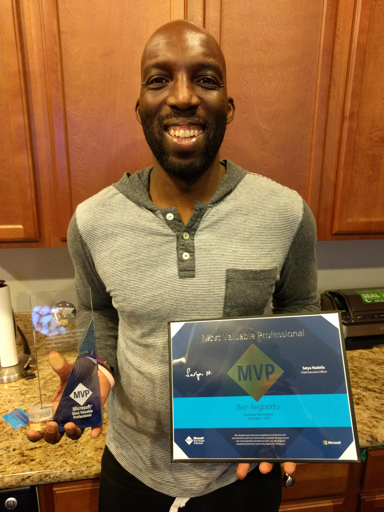

This morning I received the email I've been waiting for. I received the 2019-2020 [Microsoft Most Valuable Professional (MVP) award](https://mvp.microsoft.com/) "in recognition of [my] exceptional technical community leadership" in the area of **Developer Technologies**!

I've been using the handle **benmvp** since the 7th grade when I was chosen as the Most Valuable Player of our basketball team. And now 20 years later, I've got another reason to be an MVP. 😄

This is kind of been a long time coming for me. I first heard about the Microsoft MVP award at [Prairie Dev Con 2016](http://www.prairiedevcon.com/) when I met [David Wesst](https://twitter.com/davidwesst) (not to be confused with [David West](<https://en.wikipedia.org/wiki/David_West_(basketball)>) who just retired from the NBA). David nominated me to the receive the award way back in August 2016. And then [Jonathan Creamer](https://twitter.com/jcreamer898) nominated me _again_ exactly a year ago.

But regardless of whatever delay I may feel, I'm thankful and honored to be a part of the Microsoft MVP professionals! A group of super smart women and men who love to contribute in making development easier for all of us. I'm looking forward to see what all that being award entails.

