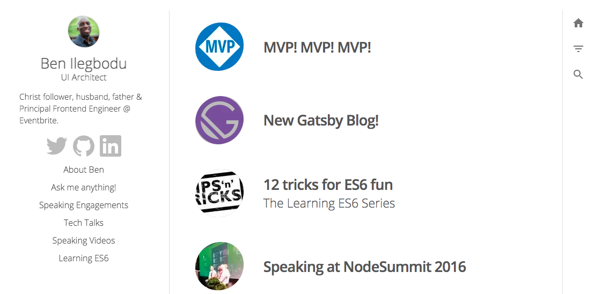
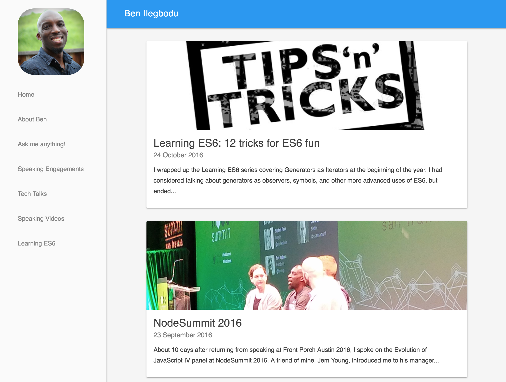

Almost 2 years to the day I shared how I had transitioned my Jekyll-based blog over to a [Gatsby blog](/blog/new-gatsby-blog/). At the time I didn't want to put in too much effort into it. I just wanted to be able to copy over my Markdown files into something that looked decent and move on. The reason for the switch then was that the Jekyll blog was a pain to view locally.

I specifically wanted to use Gatsby because it was becoming popular and generated performant sites. But I didn't want to invest the time learning it back then. I was really busy preparing talks for various [speaking engagements](/speak/). So I used a starter kit that gave me a really nice aesthetic, decent UX, and the ability to just write Markdown files. I did tweak some React components here and there, but I had **no clue** how the plugins or GraphQL worked.

Fast forward 2 years and now I have different goals. The UX of the site felt a bit clunky to navigate to pages that were not blog posts (speaking engagements, [past videos](/videos/), etc). So this site redesign had both functional and aesthetic aspects.

On the functional side, I wanted to upgrade to [Gatsby v2](https://www.gatsbyjs.org/blog/2018-09-17-gatsby-v2/), which had come out only a few months after I had transitioned my blog over using Gatsby v1 🤦🏾‍♂️. Since I didn't build the first Gatsby blog, I had no idea what to do in order to [migrate from v1 to v2](https://www.gatsbyjs.org/docs/migrating-from-v1-to-v2/). So I just decided to start from scratch. I also wanted to functionally change the site from being a blog site, to a site with a blog. This would open up the site for some plans I have in the near and distant future (more to come!).

Because I decided to start from scratch, however, I needed to also design the site from scratch. And any time I need a nice-looking visual aesthetic, I always reach to the [Material-UI](https://material-ui.com/) component library built on top of Google's Material Design system. It's got everything I need without having to worry too much about colors and such. I just use the components and configure them as necessary. The funny thing is that my original Jekyll-based blog was also based on Material Design, so now my site looks like it did originally.

Now that I have successfully rebuilt the site from the ground up following the [Gatsby tutorial](https://www.gatsbyjs.org/tutorial/), I pretty much understand how everything all the code power my site, including how to configure the [25+ plugins](https://github.com/benmvp/benmvp.com/blob/17c7abf254f32ed8cbc58f3c327f5944ef89cc2a/gatsby-config.js) that amazing functionality. It took me a little over [3 weeks off and on](https://github.com/benmvp/benmvp.com/pull/19) to rebuild the site. There was **a lot** of learning and hair pulling that happened in those 3 weeks. There will likely be follow-up posts sharing some of those.

Up until this point, it's been mostly feature parity, although both the [homepage](/) and [blog home](/blog/) are new. Now I have a good foundation to start putting in some of the new functionality to help grow the site.

Keep learning my friends. 🤓
