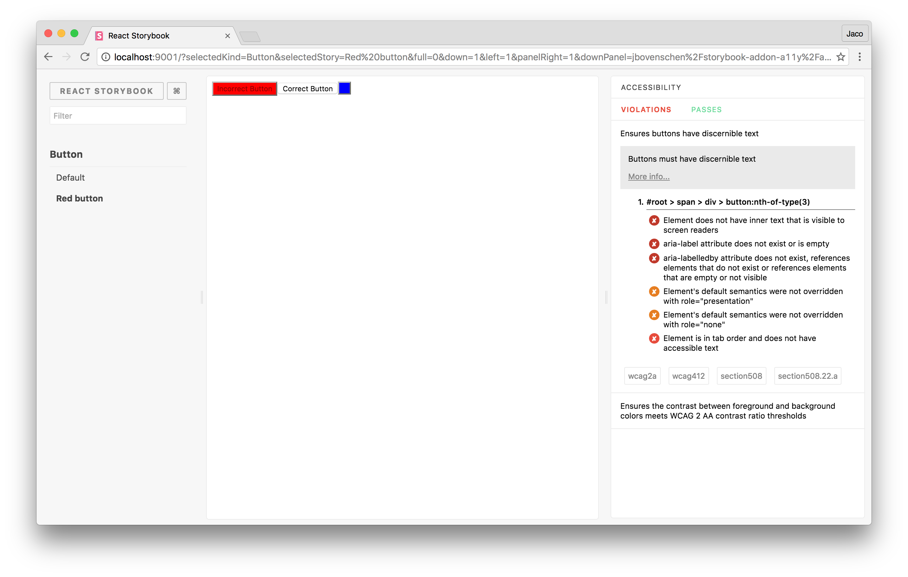
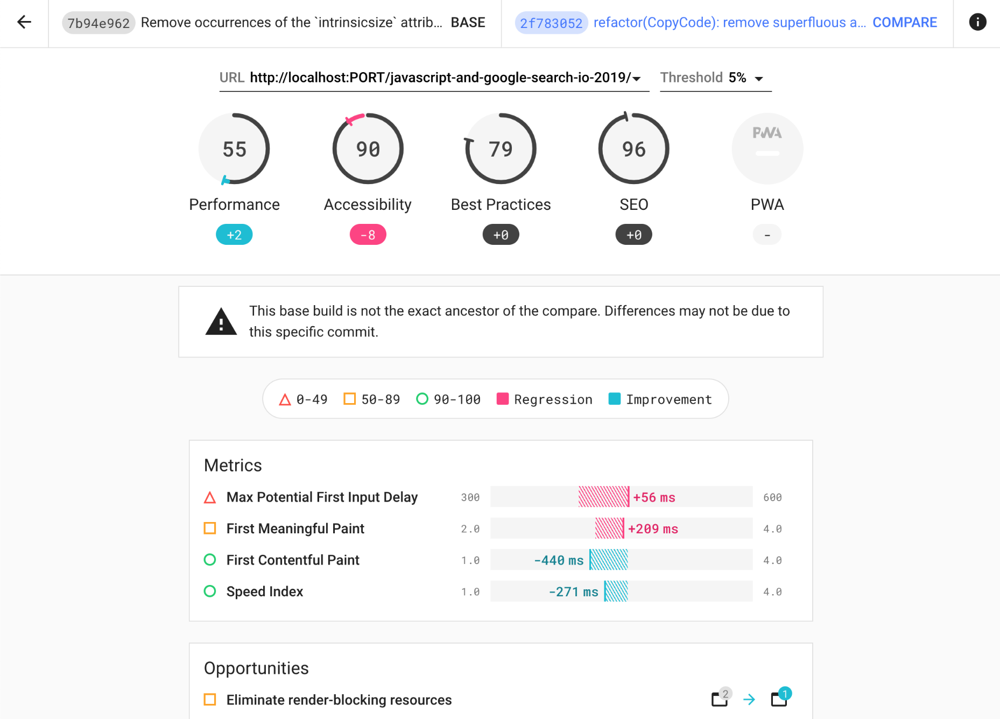

I've learned a lot about accessibility these last 2 years working at Stitch Fix. I don't know if it's because I've been working on our design system where I've had to make accessible components. Or if it's simply that the industry has raised its collective awareness of the needs for developing accessibility features.

**While accessibility features are an absolute necessity for some to use our sites, many of them are also beneficial to everyone.** High color contrast is important for the visually impaired, but also comes in handy when a "well-sighted" person is on their phone in the sunlight. Having proper keyboard interactions is critical for those who cannot use a mouse, but are also useful for keyboard power users.

<blockquote class="twitter-tweet"><p lang="en" dir="ltr">Good <a href="https://twitter.com/hashtag/a11y?src=hash&amp;ref_src=twsrc%5Etfw">#a11y</a> features are beneficial for lots of people. <a href="https://t.co/2RMnTzseey">pic.twitter.com/2RMnTzseey</a></p>&mdash; Chris Heilmann (@codepo8) <a href="https://twitter.com/codepo8/status/1409559894265565188?ref_src=twsrc%5Etfw">June 28, 2021</a></blockquote>

[React](https://reactjs.org/) has gotten a bad rep about creating unaccessible apps. I've even seen people ask if React itself is unaccessible. I can't be 100% certain, but I don't think unaccessible apps are not unique to React. It just happens to be the most popular web development library right now. **I think apps built with all of the JavaScript frameworks have accessibility problem.** They make it so much easier to build interactivity. But unless we know the rules, we can just as easily build that interactivity in an unaccessible manner.

Instead, we should be creating accessible UIs making the full use of the semantic HTML elements and CSS. Anything clickable should be a `<button>` element and anything that navigates should be an `<a>` element. A UI that lets the user pick one or more options should be radio or checkbox `<input>` elements. It takes a bit more CSS to override the default behavior of these tags and style them the way we want, but **then we don't have to worry about recreating all the behavior the browser does for them**. And when we need to build UIs that native HTML cannot handle, we can always lean on [ARIA](https://developer.mozilla.org/en-US/docs/Web/Accessibility/ARIA) to help the browser understand what's going on.

But this post isn't about how to write accessible web apps. Instead it's about how we can validate, using automated tooling, whether or not our app is accessible. There are five tools that I want to discuss that can help us catch accessibility issues in web apps at several different stages of development/test/deployment. **My personal experience is with React applications, of course, but most of the tools we'll look at are framework-agnostic.**

Let's jump right in!

---

## Development

[Storybook](https://storybook.js.org/) is a popular open-source tool for building UI components and pages in isolation. By building outside of the website itself, it streamlines UI development, testing, and even documentation. It started out as a tool for [React](https://storybook.js.org/docs/react/get-started/introduction), but has since expanded to [Vue](https://storybook.js.org/docs/vue/get-started/introduction), [Angular](https://storybook.js.org/docs/angular/get-started/introduction), and others.

One of the Storybook addons is [`@storybook/addon-a11y`](https://github.com/storybookjs/storybook/tree/next/addons/a11y). **It uses [`axe-core`](https://github.com/dequelabs/axe-core) to surface accessibility issues in the Storybook stories we develop.** It runs and updates every time we change a story. I really like it because (unlike some of the other tools we'll see), it runs in the browser. So it can catch issues with the final visual render (like [color contrast](https://webaim.org/articles/contrast/)) in addition to issues with the markup structure (like missing `alt` or incorrect `role` attributes).

[](https://github.com/storybookjs/storybook/tree/next/addons/a11y)

While it does run automatically, we still have to look at the Accessibility panel and fix the issues. It doesn't run in our continuous integration (CI) pipeline so it can't fail a pull request.

---

## Static code checking

[ESLint](http://eslint.org/) statically analyzes our code to quickly find problems. We can run it as part of our CI pipeline to auto-block PRs when our code breaks rules that we've set up. Many rules are stylistic, but many frameworks create ESLint plugins with rules to prevent errors or gotchas specific to the framework (like [`eslint-plugin-react`](https://github.com/yannickcr/eslint-plugin-react) or [`eslint-plugin-vue`](https://eslint.vuejs.org/)).

**Well, there are also companion accessibility ESLint plugins that check our markup to ensure it passes a series of rules.** The [`eslint-plugin-jsx-a11y`](https://github.com/jsx-eslint/eslint-plugin-jsx-a11y) has [many rules](https://github.com/jsx-eslint/eslint-plugin-jsx-a11y#supported-rules) for JSX in React. One such [rule](https://github.com/jsx-eslint/eslint-plugin-jsx-a11y/blob/master/docs/rules/no-noninteractive-element-interactions.md) prevents us from adding mouse or keyboard event handlers to non-interactive elements (like `<main>`, `<p>`, etc.). It even includes explanations on how to fix common issues. Now instead of me or other accessibility-knowledgeable folks having to spot these issues in pull requests, ESLint can do it for us. I've learned a number of new accessibility rules by writing code that broke the rules and visiting the page that explains the rule. I've never used it before, but [`eslint-plugin-vue-a11y`](https://github.com/maranran/eslint-plugin-vue-a11y) also exists for Vue applications.

While the ESLint accessibility plugins can catch lots of issues, they miss a lot too. If two components combine together provide an accessibility feature, validating them individually may provide false positives. Also, since it doesn't run in the browser, it'll miss anything that requires browser context (like CSS rendering). ESLint is just one piece of our accessibility-checking arsenal.

---

## Unit testing

There are two main tools I use when writing component unit tests in [Jest](https://jestjs.io/): [Testing Library](https://testing-library.com/) (specifically [React Testing Library](https://testing-library.com/docs/react-testing-library/intro/)) and [`jest-axe`](https://github.com/nickcolley/jest-axe).

Testing Library's goal is to help us write maintainable tests, by writing tests that interact with our components in the same way as our users. **This approach has a wonderful byproduct of also forcing our code to be more accessible.** Instead of finding a text input by a `data-*` attribute (or worse by a class name) in order to type into it, we find it by its [label text](https://testing-library.com/docs/queries/bylabeltext). We can also find elements [by their ARIA role](https://testing-library.com/docs/queries/byrole), [by their alt text](https://testing-library.com/docs/queries/byalttext), or [by their title](https://testing-library.com/docs/queries/bytitle). There is an escape hatch to find [by a `data-testid` attribute](https://testing-library.com/docs/queries/bytestid), but I always try to see what I can do to leverage the other queries. That extra effort results in my UI being a bit more accessible.

```js
import { render } from '@testing-library/react'
import Welcome from './Welcome'

test('has correct input value', () => {
  const { getByRole } = render(<Welcome firstName="John" lastName="Doe" />)
  // highlight-next-line
  const form = getByRole('form')

  expect(form).toHaveFormValues({
    firstName: 'John',
    lastName: 'Doe',
  })
})
```

In addition to React (the original), there's also [Vue Testing Library](https://testing-library.com/docs/react-testing-library/example-intro), [Angular Testing Library](https://testing-library.com/docs/react-testing-library/example-intro), [Svelte Testing Library](https://testing-library.com/docs/react-testing-library/example-intro), and many others.

While Testing Library encourages more accessible code in order to write maintainable tests, **[`jest-axe`](https://github.com/nickcolley/jest-axe) actually does accessibility validation on our component markup generated by the test**. Just like [`@storybook/addon-a11y`](https://github.com/storybookjs/storybook/tree/next/addons/a11y), it too uses [`axe-core`](https://github.com/dequelabs/axe-core) under-the-hood for testing accessibility. After using Testing Library to validate the functionality of my code, I'll add the `jest-axe` assertion at the end to validate the accessibility.

```js
import { render } from '@testing-library/react'
import Welcome from './Welcome'

const { axe, toHaveNoViolations } = require('jest-axe')
expect.extend(toHaveNoViolations)

test('has correct input value', async () => {
  const { container, getByRole } = render(
    <Welcome firstName="John" lastName="Doe" />,
  )
  const form = getByRole('form')

  expect(form).toHaveFormValues({
    firstName: 'John',
    lastName: 'Doe',
  })

  // highlight-next-line
  expect(await axe(container)).toHaveNoViolations()
})
```

`jest-axe` is framework agnostic. We need to give it some markup to evaluate, and it takes care of the rest. The `container` object from `render()` in Testing Library gives us what we need for all of the various frameworks.

---

## End-to-end testing

[Lighthouse](https://developers.google.com/web/tools/lighthouse/) is an open-source, automated tool for improving the quality of our web pages. We can run it against any web page and it produces audits for many features of a web page, including accessibility. We can run Lighthouse in [Chrome DevTools](https://developers.google.com/web/tools/lighthouse/#devtools) on an ad-hoc basis to test our web application. But as part of our automated end-to-end regression test on our website, **we can use [Lighthouse CI](https://github.com/GoogleChrome/lighthouse-ci/blob/main/docs/getting-started.md) to validate the accessibility of fully rendered pages**.

Once we've connected to our CI Provider of choice (I'm a big fan of [Github Actions](https://docs.github.com/en/actions)), we can configure Lighthouse CI to fail if the accessibility score dips below a specified threshold. After generating the reports, Lighthouse CI uploads them to a temporary public storage and provides a URL to access them. If we don't want these reports publicly available we can also set up [Lighthouse CI server](https://github.com/GoogleChrome/lighthouse-ci/blob/main/docs/getting-started.md#the-lighthouse-ci-server).



**By running a full page of our web app in the browser it's able to catch issues that the other tools we've looked at cannot catch.** Validating that the whole page has [heading elements that are always sequentially-descending in order](https://web.dev/heading-order/?utm_source=lighthouse&utm_medium=devtools) can only be verified at the page level. And the great thing about Lighthouse is that it always provides a "learn more" link for each accessibility issue. So it serves as a teacher as well as a validator. Lastly, because it operates on the rendered web page, it works with our favorite frameworks.

---

While these 5 tools do lots to automate finding (and teaching!) a lot of common accessibility mistakes, they don't replace testing our UIs ourselves. Testing our UIs with [assistive devices](https://www.gov.uk/service-manual/technology/testing-with-assistive-technologies#when-to-test) not only helps us verify that our code is correct (or woefully broken), but should give us some empathy as well. And we also can't avoid the responsibility of [learning more](https://www.youtube.com/watch?v=z8xUCzToff8) about accessibility best practices.

Are there any other automated tools you use for validating accessibility? I'm interested in adding event more to my pipeline. Feel free to reach out to me on Twitter at [@benmvp](https://twitter.com/benmvp).

Keep learning my friends. 🤓
